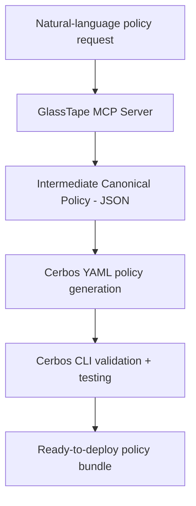

# 🧩 GlassTape Policy Builder MCP Server

[](https://opensource.org/licenses/Apache-2.0)
[](https://modelcontextprotocol.io)
[](https://python.org)

> **Transform natural language into production-ready AI governance policies.**

GlassTape **Policy Builder** is an open-source [MCP server](https://modelcontextprotocol.io) that converts natural-language security requirements into **Cerbos YAML policies** with automated validation, testing, and red-teaming.  
It enables security and engineering teams to integrate **AI agents and applications** with **policy-as-code** frameworks—bringing zero-trust guardrails to tool-call interception, data access, and model workflows.

## 🚀 Features

- ⚙️ **Natural-Language to Policy** – Generate Cerbos policies from plain English using Claude or AWS Q
- 🧠 **Automated Validation** – Uses the Cerbos CLI (`cerbos compile`, `cerbos test`) for syntax and logic checks
- 🧪 **Red-Team Analysis** – Detects evasion, injection, and logic flaws automatically
- 🧩 **MCP Integration** – Works natively in IDEs like **Cursor**, **Zed**, and **Claude Desktop**
- 🔒 **Air-Gapped Operation** – Local-first design with no external dependencies
- 🧾 **Compliance Mapping** – Built-in templates for SOX, HIPAA, PCI-DSS, and EU AI Act

## 🚀 Quick Start

### 1. Prerequisites

**Install Cerbos CLI** (required for policy validation):

```bash
# macOS
brew install cerbos/tap/cerbos

# Linux
curl -L https://github.com/cerbos/cerbos/releases/latest/download/cerbos_Linux_x86_64 \
  -o /usr/local/bin/cerbos && chmod +x /usr/local/bin/cerbos

# Verify installation
cerbos version
```

### 2. Install the MCP Server

```bash
# Basic installation
pip install glasstape-policy-builder-mcp

# With optional LLM support (for server-side natural language parsing)
pip install glasstape-policy-builder-mcp[anthropic]  # Anthropic Claude
pip install glasstape-policy-builder-mcp[openai]     # OpenAI GPT
pip install glasstape-policy-builder-mcp[llm]        # All LLM providers

# Development installation
pip install glasstape-policy-builder-mcp[dev]
```

### 3. Configure Your MCP Client

**Claude Desktop** (`~/Library/Application Support/Claude/claude_desktop_config.json`):

```json
{
  "mcpServers": {
    "glasstape-policy-builder": {
      "command": "glasstape-policy-builder-mcp"
    }
  }
}
```

**Cursor/Zed**: Add similar configuration in your IDE's MCP settings.

**Optional: Server-side LLM** (for natural language processing):

```json
{
  "mcpServers": {
    "glasstape-policy-builder": {
      "command": "glasstape-policy-builder-mcp",
      "env": {
        "LLM_PROVIDER": "anthropic",
        "ANTHROPIC_API_KEY": "sk-ant-your-key"
      }
    }
  }
}
```

### 4. Usage Examples

**Generate a Policy** (in Claude Desktop or MCP-enabled IDE):

```
Create a payment policy for AI agents:
- Allow payments up to $50
- Block sanctioned entities
- Limit to 5 transactions per 5 minutes
```

**List Available Templates**:

```
list_templates
```

**Validate a Policy**:

```
validate_policy with policy_yaml: "<your-cerbos-yaml>"
```

### 5. Troubleshooting

**Cerbos CLI not found**:
- Ensure Cerbos CLI is installed and in your PATH
- Run `cerbos version` to verify installation

**MCP server not connecting**:
- Check your MCP client configuration
- Restart your IDE after configuration changes
- Verify the command path is correct

**Policy validation fails**:
- Check YAML syntax in generated policy
- Ensure Cerbos CLI is working: `cerbos compile --help`
- Review error messages for specific issues

**Import errors**:
- Ensure you have Python 3.10 or higher
- Try reinstalling: `pip uninstall glasstape-policy-builder-mcp && pip install glasstape-policy-builder-mcp`

## 🦭 Available Tools

When connected via MCP, you can use these tools in Claude or your IDE:

| Tool                   | What it does                                               |
| ---------------------- | ---------------------------------------------------------- |
| `generate_policy`      | Transform natural language → validated Cerbos YAML         |
| `validate_policy`      | Check policy syntax with `cerbos compile`                  |
| `test_policy`          | Run test suites against your policy                        |
| `suggest_improvements` | Analyze for security gaps (rate limits, SOD, sanctions)    |
| `list_templates`       | Browse built-in templates (finance, healthcare, AI safety) |

**Example workflow:**

```
1. "Generate a payment policy for AI agents with $50 limit..."
   → Claude calls generate_policy
   
2. "Create a comprehensive test suite for this policy"
   → Claude calls generate_test_suite
   
3. "Add hourly spending limits and sanction checks"
   → Claude calls suggest_improvements
   
4. "Save this policy bundle"
   → Claude calls save_policy
```

## 🧪 Example Output

**Input:**

```
"Allow AI agents to execute payments up to $50. Block sanctioned entities. 
Limit cumulative hourly amount to $50. Maximum 5 transactions per 5 minutes."
```

**Generated Policy:**

```yaml
# policies/payment_policy.yaml
apiVersion: api.cerbos.dev/v1
resourcePolicy:
  version: "1.0.0"
  resource: "payment"
  rules:
    - actions: ["execute"]
      effect: EFFECT_ALLOW
      condition:
        match:
          expr: >
            request.resource.attr.amount > 0 &&
            request.resource.attr.amount <= 50 &&
            !(request.resource.attr.recipient in request.resource.attr.sanctioned_entities) &&
            (request.resource.attr.cumulative_amount_last_hour + request.resource.attr.amount) <= 50 &&
            request.resource.attr.agent_txn_count_5m < 5
    - actions: ["*"]
      effect: EFFECT_DENY
```

**Plus:**

* ✅ 15+ automated test cases
* ✅ Validated by `cerbos compile`
* ✅ Ready-to-deploy bundle

## 📋 Complete Examples

| Category | Example | Description |
|----------|---------|-------------|
| **Finance** | [payment_policy.md](examples/payment_policy.md) | Payment execution with limits |
| **Healthcare** | [phi_access_policy.md](examples/phi_access_policy.md) | HIPAA-compliant PHI access |
| **AI Safety** | [ai_model_invocation_policy.md](examples/ai_model_invocation_policy.md) | Model invocation with guardrails |
| **Data Access** | [pii_export_policy.md](examples/pii_export_policy.md) | GDPR-compliant PII export control |
| **System** | [admin_access_policy.md](examples/admin_access_policy.md) | Admin access with MFA |

See [examples/README.md](examples/README.md) for complete examples.

## 🧱 Architecture



**Key Innovation:**
ICP (Intermediate Canonical Policy) serves as a language-agnostic intermediate representation, enabling deterministic generation, policy portability, and formal verification.

## 🧪 Development

```bash
# Clone and setup
git clone https://github.com/glasstape/glasstape-policy-builder-mcp.git
cd glasstape-policy-builder-mcp
pip install -e ".[dev]"

# Run tests
pytest

# Format code
black src/ tests/
```

## 🤝 Contributing

We welcome contributions! See [CONTRIBUTING.md](CONTRIBUTING.md) for guidelines.

**Quick Links:**

* [Code of Conduct](CODE_OF_CONDUCT.md)
* [Security Policy](SECURITY.md)

---

## 💪 License

Released under the [Apache 2.0 License](LICENSE).
© 2025 GlassTape, Inc.

---

## 💡 Links

* 🌐 [GlassTape Website](https://glasstape.ai)
* 📚 [Documentation](https://docs.glasstape.com/agent-policy-builder)
* 🧱 [Cerbos Documentation](https://docs.cerbos.dev)
* 🧩 [Model Context Protocol](https://modelcontextprotocol.io)
* 🐛 [Report Issues](https://github.com/glasstape/glasstape-policy-builder-mcp/issues)

---

**Built with ❤️ by [GlassTape](https://glasstape.ai)** — *Making AI agents secure by default.*