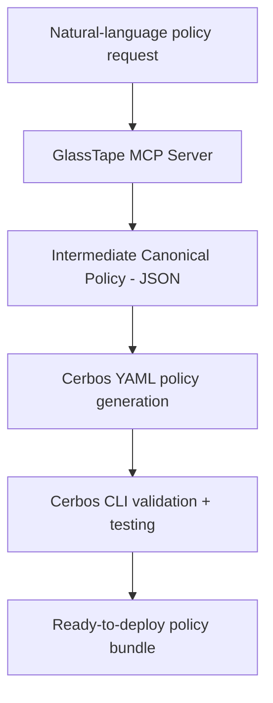

# 🧩 GlassTape Agent Policy Builder (MCP Server)

[](https://opensource.org/licenses/Apache-2.0)
[](https://modelcontextprotocol.io)

> **Transform natural language into production-ready AI governance policies.**

GlassTape **Agent Policy Builder** is an open-source [MCP server](https://modelcontextprotocol.io) that converts natural-language security requirements into **Cerbos YAML policies** with automated validation, testing, and red-teaming.  
It enables security and engineering teams to integrate **AI agents and applications** with **policy-as-code** frameworks—bringing zero-trust guardrails to tool-call interception, data access, and model workflows.

---

## 🚀 Features

- ⚙️ **Natural-Language to Policy** – Generate Cerbos policies from plain English using Claude or AWS Q.
- 🧠 **Automated Validation** – Uses the Cerbos CLI (`cerbos compile`, `cerbos test`) for syntax and logic checks.
- 🧪 **Red-Team Analysis** – Detects evasion, injection, and logic flaws automatically.
- 🧩 **MCP Integration** – Works natively in IDEs like **Cursor**, **Zed**, and **Claude Desktop**.
- 🔒 **Air-Gapped Operation** – Local-first design with no external dependencies.
- 🧾 **Compliance Mapping** – Built-in templates for SOX, HIPAA, PCI-DSS, and EU AI Act.

---

## 🧰 Installation

```bash
npm install -g @glasstape/agent-policy-builder-mcp
````

### Prerequisites

Install the [Cerbos CLI](https://docs.cerbos.dev/cerbos/latest/installation):

```bash
# macOS
brew install cerbos/tap/cerbos

# Linux
curl -L https://github.com/cerbos/cerbos/releases/latest/download/cerbos_Linux_x86_64 \
  -o /usr/local/bin/cerbos && chmod +x /usr/local/bin/cerbos

# Verify
cerbos version
```

---

## ⚡ Usage

### 1. Add to your MCP client (Claude Desktop, Cursor, etc.)

**Claude Desktop** (`~/Library/Application Support/Claude/claude_desktop_config.json`):

```json
{
  "mcpServers": {
    "agent-policy-builder": {
      "command": "agent-policy-builder-mcp",
      "env": {
        "ANTHROPIC_API_KEY": "sk-ant-..."
      }
    }
  }
}
```

### 2. Use in your IDE or Claude chat

```
Create a payment policy that blocks transactions over $50
and prevents splitting attacks.
```

→ The MCP server generates and validates a `payment_policy.yaml` for Cerbos.

---

## 🧪 Example Output

**Input:**

```
"Allow AI agents to execute payments up to $50. Block sanctioned entities. 
Limit cumulative hourly amount to $50. Maximum 5 transactions per 5 minutes."
```

**Generated Policy:**

```yaml
# policies/payment_policy.yaml
apiVersion: api.cerbos.dev/v1
resourcePolicy:
  version: "1.0.0"
  resource: "payment"
  rules:
    - actions: ["execute"]
      effect: EFFECT_ALLOW
      condition:
        match:
          expr: >
            request.resource.attr.amount > 0 &&
            request.resource.attr.amount <= 50 &&
            !(request.resource.attr.recipient in request.resource.attr.sanctioned_entities) &&
            (request.resource.attr.cumulative_amount_last_hour + request.resource.attr.amount) <= 50 &&
            request.resource.attr.agent_txn_count_5m < 5
```

**Plus:**

* ✅ 15+ automated test cases
* ✅ Validated by `cerbos compile`
* ✅ Ready-to-deploy bundle

---

## 🧭 Available Tools

When connected via MCP, you can use these tools in Claude or your IDE:

| Tool                   | What it does                                               |
| ---------------------- | ---------------------------------------------------------- |
| `generate_policy`      | Transform natural language → validated Cerbos YAML         |
| `generate_test_suite`  | Create comprehensive test cases                            |
| `validate_policy`      | Check policy syntax with `cerbos compile`                  |
| `test_policy`          | Run test suites against your policy                        |
| `suggest_improvements` | Analyze for security gaps (rate limits, SOD, sanctions)    |
| `explain_policy`       | Generate human-readable documentation                      |
| `save_policy`          | Export validated, production-ready policy bundle           |
| `list_templates`       | Browse built-in templates (finance, healthcare, AI safety) |

**Example workflow:**

```
1. "Generate a payment policy for AI agents with $50 limit..."
   → Claude calls generate_policy
   
2. "Create a comprehensive test suite for this policy"
   → Claude calls generate_test_suite
   
3. "Add hourly spending limits and sanction checks"
   → Claude calls suggest_improvements
   
4. "Save this policy bundle"
   → Claude calls save_policy
```

---

## 🧱 Architecture



**Key Innovation:**
ICP (Intermediate Canonical Policy) serves as a language-agnostic intermediate representation, enabling deterministic generation, policy portability, and formal verification.

---

## 🤝 Contributing

We welcome contributions! See [CONTRIBUTING.md](CONTRIBUTING.md) for guidelines.

**Quick Links:**

* [Code of Conduct](CODE_OF_CONDUCT.md)
* [Issue Templates](.github/ISSUE_TEMPLATE/)
* [Security Policy](SECURITY.md)

---

## 🪪 License

Released under the [Apache 2.0 License](LICENSE).
© 2025 GlassTape, Inc.

---

## 💡 Links

* 🌐 [GlassTape Website](https://glasstape.ai)
* 📖 [Documentation](https://docs.glasstape.com/agent-policy-builder)
* 🧱 [Cerbos Documentation](https://docs.cerbos.dev)
* 🧩 [Model Context Protocol](https://modelcontextprotocol.io)
* 💬 [Community Discord](https://discord.gg/glasstape) *(coming soon)*
* 🐛 [Report Issues](https://github.com/glasstape/agent-policy-builder-mcp/issues)

---

**Built with ❤️ by [GlassTape](https://glasstape.ai)** — *Making AI agents secure by default.*
