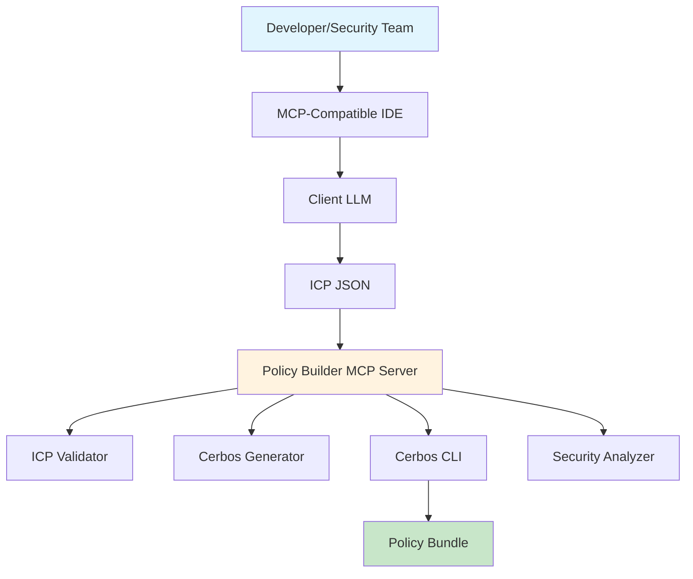
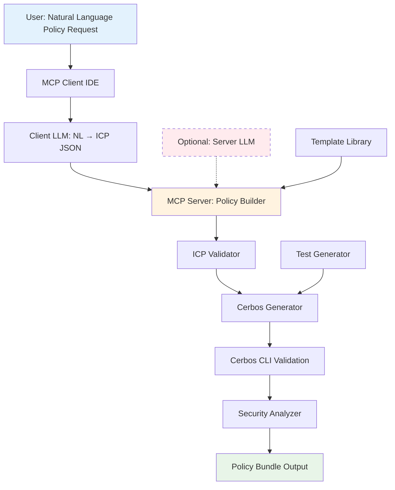
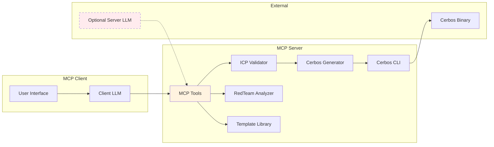

# GlassTape Agent Policy Builder: MVP Technical Implementation

**Version 1.1 - Implementation-Aligned Edition (Python)**  
*MCP Server for Natural Language → Cerbos Policy Generation*

---

## Table of Contents

1. [Executive Summary](#executive-summary)
2. [MVP Scope & Implementation Status](#mvp-scope--implementation-status)  
3. [System Architecture](#system-architecture)
4. [Operating Modes](#operating-modes)
5. [MCP Tools](#mcp-tools)
6. [Core Components](#core-components)
7. [Simple ICP Format](#simple-icp-format)
8. [Customer Workflow Examples](#customer-workflow-examples)
9. [Template Library](#template-library)
10. [Security Analysis](#security-analysis)
11. [Testing Strategy](#testing-strategy)
12. [Deployment Guide](#deployment-guide)
13. [Phase Roadmap](#phase-roadmap)
14. [Appendices](#appendices)

---

## Executive Summary

### Vision
Let developers/security teams write guardrails in plain English inside an MCP-compatible IDE (Claude Desktop, Cursor, Zed, Q), and get back a validated Cerbos YAML policy and tests—ready to ship.

### One-liner
**Write guardrails in natural language, get enterprise-grade Cerbos policies instantly.**

### What This Delivers
The **GlassTape Agent Policy Builder** is a production-ready MCP server that converts natural language security requirements into **validated Cerbos YAML policies**. Built with Python 3.10+, it emphasizes security, determinism, and air-gapped operation.

### Key Value Propositions
- 🎯 **Zero Learning Curve**: Write policies in plain English, not YAML or JSON
- 🔒 **Enterprise Security**: Client-LLM mode by default, no mandatory cloud dependencies
- ✅ **Production Ready**: Automated validation via Cerbos CLI, comprehensive test generation
- 🚀 **Instant Results**: Complete policy bundle in <10 seconds
- 🏢 **Compliance Built-in**: Templates for HIPAA, SOX, GDPR, PCI-DSS

### Technology Architecture


---

## MVP Scope & Implementation Status

✅ **Natural language → Cerbos YAML** (via MCP client's LLM; no server SDKs or keys required)  
✅ **Validation & tests** with Cerbos CLI (cerbos compile, cerbos test)  
✅ **Basic security analysis** (5 checks: default-deny, rate limits, sanctions, input validation, roles)  
✅ **Template library** (finance, healthcare, AI safety, data access, system)  
✅ **Local-first / air-gapped operation** by default  
✅ **Optional server-side LLM adapter** (env-gated) for teams without LLM-capable IDEs  

**Deliberately not included**: cryptographic signing, YAML↔ICP round-trips as a core path, heavy server-LLM dependencies.

---

## System Architecture

### High-Level Data Flow



### Component Interaction



---

## Operating Modes

### A. Default (Recommended): Client-LLM mode
- The MCP client's LLM (Claude/Cursor/Zed/Q) turns the user's natural language into a simple ICP JSON (a thin, stable intermediate)
- The server validates ICP → generates Cerbos YAML → runs compile & tests → returns bundle
- **No API keys, no network calls; fully air-gapped if the client runs locally**

### B. Optional: Server-LLM mode
- If an IDE lacks LLMs, set LLM_PROVIDER + API key on the server
- The server converts NL → ICP JSON, then does the same deterministic path
- Trade-off: introduces secrets and network dependency

**Why not depend on Anthropic/OpenAI?** Because customers already have LLMs in their IDEs. We avoid vendor lock-in, reduce secrets/ops, and keep the critical path deterministic and local.

**Notes:**
- [Cerbos YAML](https://docs.cerbos.dev/cerbos/latest/policies) is the canonical artifact
- [ICP (Intermediate Canonical Policy)](#simple-icp-format) is just a wire format between IDE and server
- Users author natural language, not JSON policies

---

## MCP Tools

The Policy Builder implements 5 core [MCP tools](https://modelcontextprotocol.io/docs/concepts/tools) that integrate seamlessly with MCP-compatible IDEs:

### generate_policy — Primary Tool
**Purpose**: Convert natural language guardrails into validated Cerbos YAML policies

**Parameters**:
- `nl_requirements` (string, optional) - Plain English description of AI guardrail or security policy
- `icp` (object, optional) - Structured ICP JSON for automation/workflow integration

**Behavior**:
- **Primary workflow**: User provides `nl_requirements`, IDE's LLM converts to ICP, then calls with `icp` parameter
- **Fallback**: If `nl_requirements` provided and server has LLM configured, converts NL → ICP → YAML (with security warning)
- **Direct**: If `icp` provided, directly generates Cerbos YAML from validated ICP
- **Guidance**: If neither LLM nor ICP available, provides detailed guidance on client-LLM workflow

**Output**: Formatted markdown with:
- Generated Cerbos YAML policy (fenced code block)
- Generated test suite (fenced code block) 
- Validation results from `cerbos compile` (if CLI available)
- Test execution results from `cerbos test` (if validation passed)
- Next steps suggestions

### validate_policy
**Parameters**: `policy_yaml` (string, required)

**Behavior**: Validates Cerbos YAML syntax using `cerbos compile`

**Output**: Success/failure with errors and warnings

### test_policy
**Parameters**: 
- `policy_yaml` (string, required)
- `test_yaml` (string, required)

**Behavior**: Runs test suite against policy using `cerbos test`

**Output**: Pass/fail counts and detailed test results

### suggest_improvements
**Parameters**: 
- `policy_yaml` (string, required) - Cerbos YAML policy to analyze

**Behavior**: Analyzes policy for security issues using SimpleRedTeamAnalyzer with 5 essential checks:
1. **Default Deny**: Verifies last rule denies all actions ("*") with EFFECT_DENY
2. **Rate Limiting**: Detects rate limiting patterns (cumulative, count, frequency keywords)
3. **Sanctions Screening**: Checks for blocklist/sanctions screening logic
4. **Input Validation**: Identifies input validation patterns (type checks, range validation)
5. **Role-Based Access**: Verifies role restrictions are implemented

**Output**: Formatted markdown report with:
- Security score (X/5 checks passed)
- Individual check results with ✅ pass, ⚠️ warn, or ❌ fail status
- Specific improvement recommendations for each failed/warned check
- Overall readiness assessment

### list_templates
**Parameters**: 
- `category` (string, optional) - Filter by category: finance, healthcare, ai_safety, data_access, or system

**Behavior**: Returns curated policy templates from [TemplateLibrary](#template-library). Available templates:
- **Payment Execution** (finance) - AI agent payments with limits and sanctions
- **PHI Access** (healthcare) - HIPAA-compliant patient record access  
- **AI Model Invocation** (ai_safety) - Model invocation with prompt filtering
- **PII Export Control** (data_access) - GDPR-compliant data export controls
- **Admin Access** (system) - Administrative access with MFA requirements

**Output**: Formatted markdown with:
- Available categories list
- For each template: name, ID, category, description, and example natural language requirement
- Usage instructions for [generate_policy](#generate_policy--primary-tool) tool

---

## Core Components

The Policy Builder is built with lean, deterministic components that ensure reliable policy generation:

### ICP Validator (`icp_validator.py`)
**Purpose**: Validates Simple ICP JSON structure without requiring any LLM
**Key validations**:
- Confirms version/metadata/policy/tests presence
- Ensures default-deny last rule (actions:["*"], effect:EFFECT_DENY)
- Requires at least 1 positive & 1 negative test
- Validates metadata fields (name in snake_case, required fields)
- Validates rule structure and test case completeness
- Uses [Pydantic](https://pydantic.dev/) models for type safety

### Cerbos Generator (`cerbos_generator.py`)
**Purpose**: Converts validated ICP to [Cerbos YAML](https://docs.cerbos.dev/cerbos/latest/policies) format deterministically
**Key features**:
- Maps condition strings → [CEL expressions](https://github.com/google/cel-spec) in condition.match.expr
- Emits proper Cerbos structure: apiVersion, resourcePolicy.version/resource/rules
- Builds Cerbos test suite from ICP tests with proper input/expected structure
- Handles role assignments and action mappings
- Joins multiple conditions with AND logic

### Cerbos CLI Wrapper (`cerbos_cli.py`)
**Purpose**: Interface with [Cerbos CLI](https://docs.cerbos.dev/cerbos/latest/cli) for validation and testing
**Key operations**:
- `check_installation()`: Verifies Cerbos CLI availability
- `compile(policy_yaml)`: Returns ValidationResult with success/errors/warnings
- `test(policy_yaml, test_yaml)`: Returns TestResult with pass/fail counts and details
- Handles subprocess execution with proper error handling and timeouts

### Simple Red-Team Analyzer (`redteam_analyzer.py`) {#security-analysis}
**Purpose**: Static security analysis with 5 essential checks
**Security checks**:
1. **Default deny principle** (fails if missing final deny-all rule)
2. **Rate limiting detection** (warns if no rate limit keywords found)
3. **Sanctions screening** (warns if no blocklist/sanctions keywords)  
4. **Input validation** (warns if no validation patterns detected)
5. **Role-based access** (warns if no role restrictions found)
**Output**: Formatted findings with pass/warn/fail status and actionable recommendations

### Template Library (`templates.py`) {#template-library}
**Purpose**: Curated policy templates for quick starts
**Available templates**:
- **Payment Execution** (finance): Amount limits, sanctions, rate limiting
- **PHI Access** (healthcare): [HIPAA](https://www.hhs.gov/hipaa) compliance, role verification, audit logging
- **AI Model Invocation** (ai_safety): Content filtering, rate limits, jailbreak protection
- **PII Export Control** (data_access): [GDPR](https://gdpr.eu/) compliance, anonymization requirements
- **Admin Access** (system): MFA requirements, approval workflows, failure limits

### LLM Adapter (`llm_adapter.py`) - Optional 
**Purpose**: Server-side natural language processing (discouraged in production)
**Key features**:
- Optional [Anthropic](https://www.anthropic.com/) adapter for environments without LLM-capable IDEs
- Warns users that client-LLM mode is preferred for security/compliance
- Minimal implementation using claude-3-haiku for cost efficiency  
- Only activated when LLM_PROVIDER environment variable is set
- Graceful fallback with guidance when not configured

---

## Simple ICP Format

The **Simple ICP** (Intermediate Canonical Policy) serves as a language-agnostic bridge between natural language and Cerbos policies.

### Design Rationale

The **Simple ICP** (Intermediate Canonical Policy) uses a flat structure instead of complex nested expression trees. This makes it:
- ✅ Easier for LLMs to generate
- ✅ Simpler to convert to Cerbos YAML
- ✅ More readable for debugging
- ✅ Still deterministic and testable
- ✅ Natural for Python dictionaries

*For complete ICP schema documentation, see [ICP Schema Documentation](#icp-schema-python) below.*

---

## Customer Workflow Examples

### How It Works in Practice

#### Scenario 1: Client-LLM Mode (Recommended - Most IDEs)

**User's perspective:**
1. User describes requirements in natural language to their IDE's AI assistant (Claude in Claude Desktop, built-in LLM in Cursor/Zed, etc.)
2. IDE's LLM automatically converts the NL description to ICP JSON format using the provided schema
3. IDE calls `generate_policy(icp={...})` with the generated ICP
4. Server validates ICP → generates Cerbos YAML → validates with CLI → returns complete bundle
5. User receives ready-to-deploy Cerbos YAML + tests + validation results + security analysis

**Example workflow in Claude Desktop:**
```
User: "Create a payment policy for AI agents. Allow payments up to $50. 
Block sanctioned entities. Limit to 5 transactions per 5 minutes."

Claude Desktop's LLM:
1. Converts to ICP JSON with proper structure
2. Calls generate_policy(icp={version: "1.0.0", metadata: {...}, policy: {...}, tests: [...]})

Server response: 
✅ Validated Cerbos YAML policy (ready for deployment)
✅ Complete test suite with positive/negative cases  
✅ Validation results from cerbos compile
✅ Security analysis from 5 essential checks
```

#### Scenario 2: Server-LLM Mode (Fallback - Discouraged)

**User's perspective:**
1. User provides natural language directly: `generate_policy(nl_requirements="...")`
2. If server has LLM configured (LLM_PROVIDER + API key env vars), server converts NL → ICP → YAML
3. User receives ready-to-deploy Cerbos YAML + tests
4. ⚠️ System warns that client-LLM mode is preferred for security and compliance

**When to use:**
- Only if your IDE lacks LLM capabilities (rare with modern IDEs)
- Only if you explicitly configure server-side LLM with environment variables
- Generally discouraged for production/enterprise use due to security implications

**Security considerations:**
- Requires API keys stored on server
- Introduces network dependencies  
- Less deterministic than client-LLM mode
- May not meet air-gapped/compliance requirements

#### Scenario 3: Direct ICP Usage (Automation/Advanced)

**User's perspective:**
1. Automated workflows or advanced users provide ICP JSON directly
2. Server validates and generates Cerbos YAML immediately
3. No LLM conversion needed

**When to use:**
- CI/CD pipelines
- Automated policy generation from structured data
- Testing and development workflows

### Key Points from Implementation
- **End users ONLY write natural language** - they never need to understand ICP JSON structure
- **ICP is invisible wire format** - automatically handled by IDE's LLM or server conversion
- **Graceful degradation** - if no server LLM configured, provides detailed guidance for client-LLM mode
- **Cerbos YAML is canonical output** - ready-to-deploy policy files for production use
- **Validation is built-in** - policies are automatically validated with Cerbos CLI if available
- **Security analysis included** - every policy gets red-team analysis with actionable recommendations

---

## Simple ICP Format

### Design Rationale

The **Simple ICP** (Intermediate Canonical Policy) uses a flat structure instead of complex nested expression trees. This makes it:
- ✅ Easier for LLMs to generate
- ✅ Simpler to convert to Cerbos YAML
- ✅ More readable for debugging
- ✅ Still deterministic and testable
- ✅ Natural for Python dictionaries

### ICP Schema (Python)

```python
# src/glasstape_policy_builder/types/icp.py

from enum import Enum
from typing import List, Optional, Dict, Any
from pydantic import BaseModel, Field


class EffectType(str, Enum):
    """Cerbos policy effect types."""
    ALLOW = "EFFECT_ALLOW"
    DENY = "EFFECT_DENY"


class ICPMetadata(BaseModel):
    """Policy metadata."""
    name: str = Field(..., description="Policy name (snake_case)")
    description: str = Field(..., description="Policy description")
    resource: str = Field(..., description="Resource type")
    compliance: Optional[List[str]] = Field(default_factory=list, description="Compliance frameworks")
    tags: Optional[List[str]] = Field(default_factory=list, description="Policy tags")


class ICPRule(BaseModel):
    """Policy rule definition."""
    actions: List[str] = Field(..., description="Actions this rule applies to")
    effect: EffectType = Field(..., description="Allow or deny effect")
    conditions: List[str] = Field(default_factory=list, description="CEL expressions")
    roles: Optional[List[str]] = Field(default=None, description="Required roles")
    description: str = Field(default="", description="Rule description")


class ICPPolicy(BaseModel):
    """Policy definition."""
    resource: str = Field(..., description="Resource type")
    version: str = Field(default="1.0.0", description="Policy version")
    rules: List[ICPRule] = Field(..., description="Policy rules")


class ICPTestInput(BaseModel):
    """Test case input."""
    principal: Dict[str, Any] = Field(..., description="Principal with id and attributes")
    resource: Dict[str, Any] = Field(..., description="Resource with id and attributes")
    actions: List[str] = Field(..., description="Actions to test")


class ICPTest(BaseModel):
    """Policy test case."""
    name: str = Field(..., description="Test name")
    category: str = Field(..., description="Test category: positive, negative, boundary, or adversarial")
    input: ICPTestInput = Field(..., description="Test input")
    expected: EffectType = Field(..., description="Expected effect")
    description: str = Field(default="", description="Test description")


class SimpleICP(BaseModel):
    """Simple Intermediate Canonical Policy."""
    version: str = Field(default="1.0.0", description="ICP format version")
    metadata: ICPMetadata = Field(..., description="Policy metadata")
    policy: ICPPolicy = Field(..., description="Policy definition")
    tests: List[ICPTest] = Field(..., description="Test cases")
```

### Example: Payment Policy ICP

```python
{
    "version": "1.0.0",
    "metadata": {
        "name": "payment_policy",
        "description": "AI agent payment execution policy with amount limits and sanctions screening",
        "resource": "payment",
        "compliance": ["SOX"],
        "tags": ["finance", "payments", "ai-agent"]
    },
    "policy": {
        "resource": "payment",
        "version": "1.0.0",
        "rules": [
            {
                "actions": ["execute"],
                "effect": "EFFECT_ALLOW",
                "roles": ["ai_agent"],
                "conditions": [
                    "request.resource.attr.amount > 0",
                    "request.resource.attr.amount <= 50",
                    "!(request.resource.attr.recipient in request.resource.attr.sanctioned_entities)",
                    "(request.resource.attr.cumulative_amount_last_hour + request.resource.attr.amount) <= 50",
                    "request.resource.attr.agent_txn_count_5m < 5"
                ],
                "description": "Allow payment execution with amount limits, sanctions check, and rate limiting"
            },
            {
                "actions": ["*"],
                "effect": "EFFECT_DENY",
                "conditions": [],
                "description": "Default deny all other actions"
            }
        ]
    },
    "tests": [
        {
            "name": "valid_payment_allowed",
            "description": "Valid payment under all limits should be allowed",
            "category": "positive",
            "input": {
                "principal": {
                    "id": "agent-123",
                    "roles": ["ai_agent"]
                },
                "resource": {
                    "id": "payment-456",
                    "attr": {
                        "amount": 30,
                        "recipient": "vendor@example.com",
                        "sanctioned_entities": ["evil@bad.com"],
                        "cumulative_amount_last_hour": 10,
                        "agent_txn_count_5m": 2
                    }
                },
                "actions": ["execute"]
            },
            "expected": "EFFECT_ALLOW"
        },
        {
            "name": "excessive_amount_denied",
            "description": "Payment exceeding $50 limit should be denied",
            "category": "negative",
            "input": {
                "principal": {
                    "id": "agent-123",
                    "roles": ["ai_agent"]
                },
                "resource": {
                    "id": "payment-789",
                    "attr": {
                        "amount": 100,
                        "recipient": "vendor@example.com",
                        "sanctioned_entities": [],
                        "cumulative_amount_last_hour": 0,
                        "agent_txn_count_5m": 0
                    }
                },
                "actions": ["execute"]
            },
            "expected": "EFFECT_DENY"
        },
        {
            "name": "sanctioned_entity_denied",
            "description": "Payment to sanctioned entity should be denied",
            "category": "negative",
            "input": {
                "principal": {
                    "id": "agent-123",
                    "roles": ["ai_agent"]
                },
                "resource": {
                    "id": "payment-999",
                    "attr": {
                        "amount": 25,
                        "recipient": "evil@bad.com",
                        "sanctioned_entities": ["evil@bad.com"],
                        "cumulative_amount_last_hour": 0,
                        "agent_txn_count_5m": 0
                    }
                },
                "actions": ["execute"]
            },
            "expected": "EFFECT_DENY"
        }
    ]
}
```

---

## Core Components

### 1. MCP Server Core

**File**: `src/glasstape_policy_builder/server.py`

```python
"""
GlassTape Agent Policy Builder MCP Server

Main server implementation for the MCP protocol.
LLM-agnostic design - works with client's LLM by default.
"""

import asyncio
from mcp.server import Server
from mcp.server.stdio import stdio_server

from .tools import register_tools


async def main():
    """Run the MCP server"""
    
    # Create server
    server = Server("glasstape-policy-builder")
    
    # Register all tools
    # No API key required - tools work with ICP JSON input by default
    await register_tools(server)
    
    # Run server with stdio transport
    async with stdio_server() as (read_stream, write_stream):
        await server.run(
            read_stream,
            write_stream,
            server.create_initialization_options()
        )


if __name__ == "__main__":
    asyncio.run(main())
```

---

### 2. ICP Validator (Core)

**File**: `src/glasstape_policy_builder/icp_validator.py`

```python
"""
ICP Validator

Validates Simple ICP JSON structure without requiring any LLM.
"""

import json
from typing import Any


class ICPValidator:
    """Validate Simple ICP structure"""
    
    def validate(self, icp: dict) -> None:
        """
        Validate ICP structure
        
        Args:
            icp: Simple ICP dictionary
            
        Raises:
            ValueError: If ICP is invalid
        """
        if not isinstance(icp, dict):
            raise ValueError("ICP must be a dictionary")
        
        # Check version
        if icp.get('version') != '1.0.0':
            raise ValueError("ICP version must be 1.0.0")
        
        # Check required sections
        if 'metadata' not in icp:
            raise ValueError("ICP must have 'metadata' section")
        if 'policy' not in icp:
            raise ValueError("ICP must have 'policy' section")
        if 'tests' not in icp:
            raise ValueError("ICP must have 'tests' section")
        
        # Validate metadata
        self._validate_metadata(icp['metadata'])
        
        # Validate policy
        self._validate_policy(icp['policy'])
        
        # Validate tests
        self._validate_tests(icp['tests'])
    
    def _validate_metadata(self, metadata: dict) -> None:
        """Validate metadata section"""
        required_fields = ['name', 'description', 'resource']
        for field in required_fields:
            if field not in metadata:
                raise ValueError(f"Metadata missing required field: {field}")
        
        # Name should be snake_case
        name = metadata['name']
        if not name.replace('_', '').isalnum():
            raise ValueError(f"Metadata name should be snake_case: {name}")
        
        # Compliance should be array if present
        if 'compliance' in metadata and not isinstance(metadata['compliance'], list):
            raise ValueError("Metadata compliance must be an array")
    
    def _validate_policy(self, policy: dict) -> None:
        """Validate policy section"""
        if 'resource' not in policy:
            raise ValueError("Policy missing 'resource' field")
        if 'version' not in policy:
            raise ValueError("Policy missing 'version' field")
        if 'rules' not in policy:
            raise ValueError("Policy missing 'rules' field")
        
        rules = policy['rules']
        if not isinstance(rules, list) or len(rules) == 0:
            raise ValueError("Policy must have at least one rule")
        
        # Validate each rule
        for i, rule in enumerate(rules):
            self._validate_rule(rule, i)
        
        # Check for default deny rule
        last_rule = rules[-1]
        if last_rule.get('effect') != 'EFFECT_DENY' or '*' not in last_rule.get('actions', []):
            raise ValueError("Policy should end with a default deny rule (actions: ['*'], effect: EFFECT_DENY)")
    
    def _validate_rule(self, rule: dict, index: int) -> None:
        """Validate a single rule"""
        required_fields = ['actions', 'effect']
        for field in required_fields:
            if field not in rule:
                raise ValueError(f"Rule {index} missing required field: {field}")
        
        # Validate effect
        if rule['effect'] not in ['EFFECT_ALLOW', 'EFFECT_DENY']:
            raise ValueError(f"Rule {index} effect must be EFFECT_ALLOW or EFFECT_DENY")
        
        # Validate actions
        if not isinstance(rule['actions'], list) or len(rule['actions']) == 0:
            raise ValueError(f"Rule {index} actions must be a non-empty array")
        
        # Validate conditions if present
        if 'conditions' in rule:
            if not isinstance(rule['conditions'], list):
                raise ValueError(f"Rule {index} conditions must be an array")
    
    def _validate_tests(self, tests: list) -> None:
        """Validate tests section"""
        if not isinstance(tests, list):
            raise ValueError("Tests must be an array")
        
        if len(tests) < 2:
            raise ValueError("Must have at least 2 test cases (1 positive, 1 negative)")
        
        # Check for at least one positive and one negative test
        has_positive = any(t.get('category') == 'positive' for t in tests)
        has_negative = any(t.get('category') == 'negative' for t in tests)
        
        if not has_positive:
            raise ValueError("Must have at least one positive test case")
        if not has_negative:
            raise ValueError("Must have at least one negative test case")
        
        # Validate each test
        for i, test in enumerate(tests):
            self._validate_test(test, i)
    
    def _validate_test(self, test: dict, index: int) -> None:
        """Validate a single test case"""
        required_fields = ['name', 'category', 'input', 'expected']
        for field in required_fields:
            if field not in test:
                raise ValueError(f"Test {index} missing required field: {field}")
        
        # Validate category
        valid_categories = ['positive', 'negative', 'boundary', 'adversarial']
        if test['category'] not in valid_categories:
            raise ValueError(f"Test {index} category must be one of: {valid_categories}")
        
        # Validate expected
        if test['expected'] not in ['EFFECT_ALLOW', 'EFFECT_DENY']:
            raise ValueError(f"Test {index} expected must be EFFECT_ALLOW or EFFECT_DENY")
        
        # Validate input structure
        test_input = test['input']
        if 'principal' not in test_input:
            raise ValueError(f"Test {index} input missing 'principal'")
        if 'resource' not in test_input:
            raise ValueError(f"Test {index} input missing 'resource'")
        if 'actions' not in test_input:
            raise ValueError(f"Test {index} input missing 'actions'")


# Example usage
if __name__ == "__main__":
    validator = ICPValidator()
    
    valid_icp = {
        "version": "1.0.0",
        "metadata": {
            "name": "test_policy",
            "description": "Test",
            "resource": "test"
        },
        "policy": {
            "resource": "test",
            "version": "1.0.0",
            "rules": [
                {
                    "actions": ["read"],
                    "effect": "EFFECT_ALLOW",
                    "conditions": []
                },
                {
                    "actions": ["*"],
                    "effect": "EFFECT_DENY",
                    "conditions": []
                }
            ]
        },
        "tests": [
            {
                "name": "allow_read",
                "category": "positive",
                "input": {
                    "principal": {"id": "user", "roles": []},
                    "resource": {"id": "doc", "attr": {}},
                    "actions": ["read"]
                },
                "expected": "EFFECT_ALLOW"
            },
            {
                "name": "deny_write",
                "category": "negative",
                "input": {
                    "principal": {"id": "user", "roles": []},
                    "resource": {"id": "doc", "attr": {}},
                    "actions": ["write"]
                },
                "expected": "EFFECT_DENY"
            }
        ]
    }
    
    try:
        validator.validate(valid_icp)
        print("✓ ICP is valid")
    except ValueError as e:
        print(f"✗ Invalid ICP: {e}")
```

---

### 3. LLM Adapter (Optional)

**File**: `src/glasstape_policy_builder/llm_adapter.py`

```python
"""
Optional LLM Adapter

Provider-agnostic interface for NL → ICP conversion.
Only loaded if LLM_PROVIDER environment variable is set.
"""

import os
import json
import re
from abc import ABC, abstractmethod
from typing import Optional


class LLMAdapter(ABC):
    """Abstract interface for LLM providers"""
    
    @abstractmethod
    def nl_to_icp(self, nl_requirements: str) -> dict:
        """Convert natural language to ICP JSON"""
        pass
    
    @abstractmethod
    def suggest_improvements(self, policy_yaml: str) -> list[str]:
        """Suggest policy improvements using LLM"""
        pass


class AnthropicAdapter(LLMAdapter):
    """Anthropic Claude adapter"""
    
    def __init__(self, api_key: str):
        from anthropic import Anthropic
        self.client = Anthropic(api_key=api_key)
    
    def nl_to_icp(self, nl_requirements: str) -> dict:
        """Convert NL to ICP using Claude"""
        response = self.client.messages.create(
            model="claude-sonnet-4-5-20250929",
            max_tokens=8192,
            system=self._get_system_prompt(),
            messages=[{
                "role": "user",
                "content": f"Generate ICP JSON for:\n\n{nl_requirements}"
            }]
        )
        
        text = response.content[0].text
        json_str = self._extract_json(text)
        return json.loads(json_str)
    
    def suggest_improvements(self, policy_yaml: str) -> list[str]:
        """Suggest improvements using Claude"""
        response = self.client.messages.create(
            model="claude-sonnet-4-5-20250929",
            max_tokens=2048,
            messages=[{
                "role": "user",
                "content": f"Suggest security improvements for this Cerbos policy:\n\n```yaml\n{policy_yaml}\n```\n\nProvide 3-5 specific improvements as a bullet list."
            }]
        )
        
        text = response.content[0].text
        # Extract bullet points
        suggestions = [line.strip('- ').strip() for line in text.split('\n') if line.strip().startswith('-')]
        return suggestions
    
    def _get_system_prompt(self) -> str:
        """System prompt for ICP generation"""
        return """You are a policy normalizer. Convert natural language requirements
into ICP JSON for Cerbos generation. Output ONLY valid JSON matching this schema:

{
  "version": "1.0.0",
  "metadata": {
    "name": "snake_case_name",
    "description": "what it does",
    "resource": "resource_kind",
    "compliance": ["SOX","HIPAA","PCI-DSS","GDPR"],
    "tags": ["ai","guardrail"]
  },
  "policy": {
    "resource": "resource_kind",
    "version": "1.0.0",
    "rules": [
      {
        "actions": ["execute"],
        "effect": "EFFECT_ALLOW",
        "roles": ["agent"],
        "conditions": [
          "request.resource.attr.amount > 0",
          "request.resource.attr.amount <= 50"
        ],
        "description": "Allow with constraints"
      },
      {
        "actions": ["*"],
        "effect": "EFFECT_DENY",
        "conditions": [],
        "description": "Default deny"
      }
    ]
  },
  "tests": [
    {"name":"valid","category":"positive","input":{...},"expected":"EFFECT_ALLOW"},
    {"name":"invalid","category":"negative","input":{...},"expected":"EFFECT_DENY"}
  ]
}

Always include:
- A default deny rule as the last rule
- At least 2 tests (1 positive, 1 negative)
- Simple string conditions (not nested expressions)
"""
    
    def _extract_json(self, text: str) -> str:
        """Extract JSON from response"""
        code_block = re.search(r'```(?:json)?\s*(\{.*?\})\s*```', text, re.DOTALL)
        if code_block:
            return code_block.group(1)
        
        json_match = re.search(r'\{.*\}', text, re.DOTALL)
        if json_match:
            return json_match.group(0)
        
        raise ValueError("No JSON found in LLM response")


def get_llm_adapter() -> Optional[LLMAdapter]:
    """
    Get LLM adapter based on environment configuration
    
    Returns:
        LLMAdapter instance or None if not configured
    """
    provider = os.getenv('LLM_PROVIDER')
    
    if not provider:
        return None
    
    if provider == 'anthropic':
        api_key = os.getenv('ANTHROPIC_API_KEY')
        if not api_key:
            raise ValueError("LLM_PROVIDER=anthropic requires ANTHROPIC_API_KEY")
        return AnthropicAdapter(api_key)
    
    elif provider == 'bedrock':
        # Future: AWS Bedrock adapter
        raise NotImplementedError("Bedrock adapter coming in Phase 2")
    
    elif provider == 'openai':
        # Future: OpenAI adapter
        raise NotImplementedError("OpenAI adapter coming in Phase 2")
    
    else:
        raise ValueError(f"Unknown LLM_PROVIDER: {provider}")


# Example usage
if __name__ == "__main__":
    adapter = get_llm_adapter()
    
    if adapter:
        print("✓ LLM adapter configured")
        icp = adapter.nl_to_icp("Allow payments up to $50")
        print(json.dumps(icp, indent=2))
    else:
        print("✗ No LLM adapter configured (this is fine for client-LLM mode)")
```

## Roadmap (Only What Helps Customers Next)

**Q2:** richer analyzer (15+ checks), more templates, CI examples, policy diff

**Q3:** multi-engine backends (OPA/Cedar emitters), versioning/rollback, simulation ("what-if")

**Q4:** marketplace + community templates, IDE snippets, policy assistant

## Rationale Calls (So Customers Don't Wonder)

**Why not lock into Anthropic/OpenAI?**  
Your IDE already has an LLM. Using it reduces ops & risk, avoids lock-in, and keeps the core path local and deterministic.

**Why keep ICP at all?**  
It's a wire format between the IDE and our server—thin, predictable, LLM-friendly—so we can make YAML generation/validation deterministic. Customers author NL, not JSON.

**Why no YAML↔ICP round-trip in core?**  
It adds complexity without customer benefit. YAML is the canonical artifact. If needed, a basic converter can live in contrib/ for import/migration cases.

---

**Status:** MVP spec final • Aligned with README • Customer-first (NL→YAML) • No crypto-signing • ICP kept minimal and optional.

---

## MCP Tool Implementation

### Tool Registration

**File**: `src/glasstape_policy_builder/tools/__init__.py`

```python
"""
MCP Tool Registration and Handlers

Implements the 5 core MCP tools for policy generation and analysis.
LLM-agnostic: accepts ICP JSON by default, optionally uses LLM adapter.
"""

import json
from mcp.server import Server
from mcp.types import Tool, TextContent

from .icp_validator import ICPValidator
from .cerbos_generator import CerbosGenerator
from .cerbos_cli import CerbosCLI
from .redteam_analyzer import SimpleRedTeamAnalyzer
from .templates import TemplateLibrary
from .llm_adapter import get_llm_adapter


async def register_tools(server: Server):
    """Register all MCP tools with the server"""
    
    # Initialize components
    icp_validator = ICPValidator()
    cerbos_generator = CerbosGenerator()
    cerbos_cli = CerbosCLI()
    redteam_analyzer = SimpleRedTeamAnalyzer()
    template_library = TemplateLibrary()
    
    # Optional LLM adapter (only if configured)
    llm_adapter = get_llm_adapter()
    if llm_adapter:
        print("✓ LLM adapter configured (server-side NL parsing enabled)")
    else:
        print("✓ Running in client-LLM mode (no server-side NL parsing)")
    
    # Check Cerbos installation
    if not cerbos_cli.check_installation():
        print("WARNING: Cerbos CLI not found. Install it to enable validation and testing.")
    
    # Define tool schemas
    @server.list_tools()
    async def list_tools() -> list[Tool]:
        return [
            Tool(
                name="generate_policy",
                description="Generate Cerbos YAML policy from ICP JSON (or natural language if LLM configured)",
                inputSchema={
                    "type": "object",
                    "properties": {
                        "icp": {
                            "type": "object",
                            "description": "ICP JSON object (preferred, deterministic)"
                        },
                        "nl_requirements": {
                            "type": "string",
                            "description": "Natural language requirements (only if LLM adapter configured)"
                        }
                    },
                    "oneOf": [
                        {"required": ["icp"]},
                        {"required": ["nl_requirements"]}
                    ]
                }
            ),
            Tool(
                name="validate_policy",
                description="Check policy syntax using cerbos compile",
                inputSchema={
                    "type": "object",
                    "properties": {
                        "policy_yaml": {
                            "type": "string",
                            "description": "Cerbos policy YAML to validate"
                        }
                    },
                    "required": ["policy_yaml"]
                }
            ),
            Tool(
                name="test_policy",
                description="Run test suite against policy using cerbos test",
                inputSchema={
                    "type": "object",
                    "properties": {
                        "policy_yaml": {
                            "type": "string",
                            "description": "Cerbos policy YAML"
                        },
                        "test_yaml": {
                            "type": "string",
                            "description": "Test suite YAML"
                        }
                    },
                    "required": ["policy_yaml", "test_yaml"]
                }
            ),
            Tool(
                name="suggest_improvements",
                description="Analyze policy for security gaps with 5 essential checks",
                inputSchema={
                    "type": "object",
                    "properties": {
                        "policy_yaml": {
                            "type": "string",
                            "description": "Cerbos policy YAML to analyze"
                        },
                        "icp_json": {
                            "type": "string",
                            "description": "Optional ICP JSON for detailed analysis"
                        }
                    },
                    "required": ["policy_yaml"]
                }
            ),
            Tool(
                name="list_templates",
                description="Browse built-in policy templates (5 categories)",
                inputSchema={
                    "type": "object",
                    "properties": {
                        "category": {
                            "type": "string",
                            "enum": ["finance", "healthcare", "ai_safety", "data_access", "system"],
                            "description": "Filter templates by category"
                        }
                    }
                }
            )
        ]
    
    # Tool handlers
    @server.call_tool()
    async def call_tool(name: str, arguments: dict) -> list[TextContent]:
        try:
            if name == "generate_policy":
                return await handle_generate_policy(
                    arguments,
                    icp_validator,
                    cerbos_generator,
                    cerbos_cli,
                    llm_adapter
                )
            
            elif name == "validate_policy":
                return await handle_validate_policy(arguments, cerbos_cli)
            
            elif name == "test_policy":
                return await handle_test_policy(arguments, cerbos_cli)
            
            elif name == "suggest_improvements":
                return await handle_suggest_improvements(arguments, redteam_analyzer)
            
            elif name == "list_templates":
                return await handle_list_templates(arguments, template_library)
            
            else:
                return [TextContent(type="text", text=f"Unknown tool: {name}")]
                
        except Exception as e:
            return [TextContent(
                type="text",
                text=f"Error: {str(e)}"
            )]


async def handle_generate_policy(
    args: dict,
    icp_validator: ICPValidator,
    cerbos_generator: CerbosGenerator,
    cerbos_cli: CerbosCLI,
    llm_adapter
) -> list[TextContent]:
    """Handle generate_policy tool call"""
    
    # Determine input mode
    if 'icp' in args:
        # Mode 1: Client-LLM (preferred)
        icp = args['icp']
    elif 'nl_requirements' in args:
        # Mode 2: Server-LLM (optional)
        if not llm_adapter:
            return [TextContent(
                type="text",
                text="❌ LLM Unavailable\n\n"
                     "Natural language parsing requires LLM configuration.\n\n"
                     "**Option 1 (Recommended)**: Provide ICP JSON directly:\n"
                     "```\n"
                     "generate_policy(icp={...})\n"
                     "```\n\n"
                     "**Option 2**: Configure server-side LLM:\n"
                     "```bash\n"
                     "export LLM_PROVIDER=anthropic\n"
                     "export ANTHROPIC_API_KEY=sk-ant-...\n"
                     "```"
            )]
        
        # Use LLM adapter to generate ICP
        try:
            icp = llm_adapter.nl_to_icp(args['nl_requirements'])
        except Exception as e:
            return [TextContent(
                type="text",
                text=f"❌ LLM Error: {str(e)}\n\nTry providing ICP JSON directly instead."
            )]
    else:
        return [TextContent(
            type="text",
            text="❌ Error: Must provide either 'icp' or 'nl_requirements'"
        )]
    
    # Validate ICP
    try:
        icp_validator.validate(icp)
    except ValueError as e:
        return [TextContent(
            type="text",
            text=f"❌ Invalid ICP: {str(e)}\n\nPlease fix the ICP JSON and try again."
        )]
    
    # Generate Cerbos YAML
    policy_yaml = cerbos_generator.generate_policy(icp)
    test_yaml = cerbos_generator.generate_tests(icp)
    
    # Validate (if Cerbos is installed)
    validation = None
    if cerbos_cli.check_installation():
        validation = cerbos_cli.compile(policy_yaml)
        
        if not validation.success:
            response = f"# Policy Validation Failed\n\n"
            response += "## Errors\n\n"
            response += "\n".join(f"- {err}" for err in validation.errors)
            response += "\n\n## Generated Policy (with errors)\n\n"
            response += f"```yaml\n{policy_yaml}\n```"
            return [TextContent(type="text", text=response)]
    
    # Run tests (if validation passed)
    test_results = None
    if validation and validation.success:
        try:
            test_results = cerbos_cli.test(policy_yaml, test_yaml)
        except Exception as e:
            test_results = None
    
    # Format response
    response = f"# Policy Generated Successfully\n\n"
    response += f"## Policy: {icp['metadata']['name']}\n"
    response += f"{icp['metadata']['description']}\n\n"
    
    if icp['metadata'].get('compliance'):
        response += f"**Compliance**: {', '.join(icp['metadata']['compliance'])}\n\n"
    
    response += "## Generated Cerbos Policy\n\n"
    response += f"```yaml\n{policy_yaml}\n```\n\n"
    
    response += "## Test Suite\n\n"
    response += f"```yaml\n{test_yaml}\n```\n\n"
    
    if test_results:
        response += "## Test Results\n\n"
        response += f"✅ **{test_results.passed}/{test_results.total}** tests passed\n\n"
        
        if test_results.failed > 0:
            response += f"⚠️ **{test_results.failed}** tests failed. Review test details.\n\n"
    
    if validation and validation.warnings:
        response += "## Warnings\n\n"
        response += "\n".join(f"- {w}" for w in validation.warnings) + "\n\n"
    
    response += "\n---\n\n"
    response += "Use `suggest_improvements` to analyze this policy for security gaps.\n"
    
    return [TextContent(type="text", text=response)]


async def handle_validate_policy(
    args: dict,
    cerbos_cli: CerbosCLI
) -> list[TextContent]:
    """Handle validate_policy tool call"""
    
    validation = cerbos_cli.compile(args['policy_yaml'])
    
    if validation.success:
        response = "✅ Policy validation passed!\n\n"
        if validation.warnings:
            response += "## Warnings\n\n"
            response += "\n".join(f"- {w}" for w in validation.warnings)
    else:
        response = "❌ Policy validation failed\n\n"
        response += "## Errors\n\n"
        response += "\n".join(f"- {e}" for e in validation.errors)
    
    return [TextContent(type="text", text=response)]


async def handle_test_policy(
    args: dict,
    cerbos_cli: CerbosCLI
) -> list[TextContent]:
    """Handle test_policy tool call"""
    
    results = cerbos_cli.test(args['policy_yaml'], args['test_yaml'])
    
    response = "# Test Results\n\n"
    response += f"**Passed**: {results.passed}\n"
    response += f"**Failed**: {results.failed}\n"
    response += f"**Total**: {results.total}\n\n"
    
    if results.failed == 0:
        response += "✅ All tests passed!\n"
    else:
        response += "❌ Some tests failed. See details below:\n\n"
        response += f"```\n{results.details}\n```\n"
    
    return [TextContent(type="text", text=response)]


async def handle_suggest_improvements(
    args: dict,
    redteam_analyzer: SimpleRedTeamAnalyzer
) -> list[TextContent]:
    """Handle suggest_improvements tool call"""
    
    icp = None
    if args.get('icp_json'):
        icp = json.loads(args['icp_json'])
    
    findings = redteam_analyzer.analyze(args['policy_yaml'], icp)
    formatted = redteam_analyzer.format_findings(findings)
    
    return [TextContent(type="text", text=formatted)]


async def handle_list_templates(
    args: dict,
    template_library: TemplateLibrary
) -> list[TextContent]:
    """Handle list_templates tool call"""
    
    category = args.get('category')
    templates = template_library.list_templates(category)
    formatted = template_library.format_templates(templates)
    
    return [TextContent(type="text", text=formatted)]
```

---

## Cerbos Integration

### Installation Check Script

**File**: `src/glasstape_policy_builder/setup.py`

```python
"""
Setup and installation checks
"""

import subprocess
import sys
from pathlib import Path


def check_python_version():
    """Check Python version >= 3.10"""
    if sys.version_info < (3, 10):
        print("❌ Python 3.10 or higher is required")
        print(f"   Current version: {sys.version}")
        return False
    print(f"✓ Python {sys.version_info.major}.{sys.version_info.minor} detected")
    return True


def check_cerbos_installation():
    """Check if Cerbos CLI is installed"""
    try:
        result = subprocess.run(
            ['cerbos', 'version'],
            capture_output=True,
            text=True,
            timeout=5
        )
        if result.returncode == 0:
            print("✓ Cerbos CLI is installed")
            print(f"  {result.stdout.strip()}")
            return True
    except FileNotFoundError:
        pass
    except subprocess.TimeoutExpired:
        pass
    
    print("❌ Cerbos CLI not found")
    print("\nInstall Cerbos:")
    print("  macOS:  brew install cerbos/tap/cerbos")
    print("  Linux:  curl -L https://github.com/cerbos/cerbos/releases/latest/download/cerbos_Linux_x86_64 \\")
    print("            -o /usr/local/bin/cerbos && chmod +x /usr/local/bin/cerbos")
    return False


def check_llm_configuration():
    """Check if LLM provider is configured (optional)"""
    import os
    provider = os.getenv('LLM_PROVIDER')
    
    if not provider:
        print("ℹ️  No LLM provider configured (client-LLM mode)")
        print("   This is normal and recommended!")
        return True
    
    print(f"✓ LLM_PROVIDER={provider} (server-LLM mode)")
    
    # Check for corresponding API key
    if provider == 'anthropic':
        if os.getenv('ANTHROPIC_API_KEY'):
            print("  ✓ ANTHROPIC_API_KEY is set")
            return True
        else:
            print("  ⚠ ANTHROPIC_API_KEY not set")
            return False
    
    return True


def main():
    """Run all checks"""
    print("GlassTape Agent Policy Builder - Setup Check\n")
    
    python_ok = check_python_version()
    cerbos_ok = check_cerbos_installation()
    llm_ok = check_llm_configuration()
    
    print("\n" + "=" * 50)
    if python_ok and cerbos_ok:
        print("✅ Core requirements met! Ready to use.")
        if llm_ok:
            print("   LLM configuration is valid (if enabled)")
    else:
        print("⚠ Some checks failed. Review the output above.")
    print("=" * 50)


if __name__ == "__main__":
    main()
```

---

## Template Library

The template library is implemented in `templates.py` (shown above in Core Components).

**5 Core Templates:**

1. **Payment Execution** (Finance)
2. **PHI Access** (Healthcare)
3. **AI Model Invocation** (AI Safety)
4. **PII Export Control** (Data Access)
5. **Admin Access** (System)

Each template includes:
- Example natural language requirement
- Category classification
- Description of use case
- Expected compliance frameworks

---

## Testing Strategy

### Test Categories

1. **Positive Tests** - Valid requests that should be allowed
2. **Negative Tests** - Invalid requests that should be denied
3. **Boundary Tests** - Edge cases at exact limits
4. **Adversarial Tests** - Attack scenarios

### Minimum Test Coverage

- ✅ At least 2 tests per policy (1 positive, 1 negative)
- ✅ Each rule should have at least 1 test
- ✅ Each condition should be tested

### Test Generation

Tests are automatically generated during policy creation:
- Positive case: All constraints satisfied
- Negative cases: Each constraint violated individually
- Boundary cases: Values at exact limits

### Running Tests

**File**: `tests/test_generator.py`

```python
"""
Unit tests for policy generator
"""

import pytest
from glasstape_policy_builder.cerbos_generator import CerbosGenerator


def test_payment_policy_generation():
    """Test generating a payment policy"""
    requirements = """
    Allow AI agents to execute payments up to $50.
    Block sanctioned entities.
    Limit to 5 transactions per 5 minutes.
    """
    
    # This would use a mock in real tests
    # parser = IntentParser("test-key")
    # icp = parser.parse(requirements)
    
    # For now, use a sample ICP
    sample_icp = {
        "version": "1.0.0",
        "metadata": {
            "name": "payment_policy",
            "description": "Payment policy",
            "resource": "payment"
        },
        "policy": {
            "resource": "payment",
            "version": "1.0.0",
            "rules": [{
                "actions": ["execute"],
                "effect": "EFFECT_ALLOW",
                "conditions": ["amount <= 50"]
            }]
        },
        "tests": []
    }
    
    generator = CerbosGenerator()
    yaml_output = generator.generate_policy(sample_icp)
    
    assert "apiVersion: api.cerbos.dev/v1" in yaml_output
    assert "resource: payment" in yaml_output
    assert "EFFECT_ALLOW" in yaml_output


def test_icp_validation():
    """Test ICP validation"""
    # ICP validation testing
    from glasstape_policy_builder.icp_validator import ICPValidator
    
    validator = ICPValidator()
    
    # Valid ICP
    valid_icp = {
        "version": "1.0.0",
        "metadata": {"name": "test", "description": "test", "resource": "test"},
        "policy": {"resource": "test", "version": "1.0.0", "rules": [{}]},
        "tests": [{}, {}]
    }
    
    # Should not raise
    parser._validate_icp(valid_icp)
    
    # Invalid ICP (missing tests)
    invalid_icp = {
        "version": "1.0.0",
        "metadata": {},
        "policy": {"rules": []},
        "tests": []
    }
    
    with pytest.raises(ValueError):
        parser._validate_icp(invalid_icp)


if __name__ == "__main__":
    pytest.main([__file__, "-v"])
```

---

## Deployment Guide

### Installation

```bash
# 1. Check Python version
python3 --version  # Should be 3.10 or higher

# 2. Install Cerbos CLI
# macOS
brew install cerbos/tap/cerbos

# Linux
curl -L https://github.com/cerbos/cerbos/releases/latest/download/cerbos_Linux_x86_64 \
  -o /usr/local/bin/cerbos && chmod +x /usr/local/bin/cerbos

# 3. Verify Cerbos installation
cerbos version

# 4. Install the MCP server
pip install glasstape-policy-builder-mcp

# 5. Verify installation
glasstape-policy-builder-mcp --version

# 6. Run setup check
python -m glasstape_policy_builder.setup
```

### Configuration

**Claude Desktop**: `~/Library/Application Support/Claude/claude_desktop_config.json`

**Mode 1: Client-LLM (Default, Recommended)**
```json
{
  "mcpServers": {
    "glasstape-policy-builder": {
      "command": "glasstape-policy-builder-mcp"
    }
  }
}
```
*No API key required! Claude Desktop's LLM generates ICP JSON.*

**Mode 2: Server-LLM (Optional)**
```json
{
  "mcpServers": {
    "glasstape-policy-builder": {
      "command": "glasstape-policy-builder-mcp",
      "env": {
        "LLM_PROVIDER": "anthropic",
        "ANTHROPIC_API_KEY": "sk-ant-..."
      }
    }
  }
}
```
*Only needed if you want server-side natural language parsing.*

**Cursor/Zed**: Similar configuration in IDE settings.

### Development Setup

```bash
# Clone repository
git clone https://github.com/glasstape/glasstape-policy-builder-mcp.git
cd glasstape-policy-builder-mcp

# Create virtual environment
python3 -m venv venv
source venv/bin/activate  # On Windows: venv\Scripts\activate

# Install in development mode
pip install -e ".[dev]"

# Run tests
pytest

# Run setup check
python -m glasstape_policy_builder.setup
```

### Directory Structure

```
/var/glasstape/
└── policies/
    ├── payment_policy.yaml
    ├── payment_policy_tests.yaml
    ├── payment_policy_icp.json
    ├── phi_access_policy.yaml
    ├── phi_access_policy_tests.yaml
    └── ...
```

### Environment Variables

```bash
# Optional (for server-side NL parsing)
LLM_PROVIDER=anthropic  # or bedrock, openai (Phase 2)
ANTHROPIC_API_KEY=sk-ant-...  # only if LLM_PROVIDER=anthropic

# Optional (customize storage)
POLICY_STORAGE_PATH=/var/glasstape/policies  # Default: /tmp/glasstape-policies
LOG_LEVEL=info                                # Default: info
```

**Note**: No environment variables are required for default operation (client-LLM mode).

---

## Phase Roadmap

### Phase 0: MVP Launch (Q1 2025) ✅

**Core Features:**
- ✅ LLM-agnostic architecture (client-LLM default)
- ✅ ICP JSON validation
- ✅ Cerbos YAML generation
- ✅ 5 MCP tools
- ✅ Cerbos CLI integration
- ✅ Basic red-team analysis (5 checks)
- ✅ 5 template library
- ✅ Automated test generation
- ✅ Local-first architecture
- ✅ Python implementation
- ✅ Optional LLM adapter for server-side NL parsing

**Success Criteria:**
- 90%+ policy compile success rate
- <10s end-to-end generation (ICP → validated policy)
- 5 working templates
- Air-gap capable by default
- No mandatory API keys or cloud dependencies

---

### Phase 1: Enhanced Features (Q2 2025)

**New Features:**
- Policy signing & verification
- Separate test generation tool
- Enhanced red-team analysis (15+ checks)
- 20+ templates across categories
- Policy diff and merge tools
- Basic CI/CD integration (GitHub Actions)

**Improvements:**
- Advanced ICP validation
- Better error messages
- Performance optimizations
- Compliance reporting

---

### Phase 2: Enterprise (Q3 2025)

**Enterprise Features:**
- Multi-language support (OPA, Cedar)
- Policy versioning & rollback
- Advanced compliance frameworks
- Policy simulation ("what-if" analysis)
- Integration with GlassTape enforcement
- Team collaboration features

**Scale:**
- Multi-tenant support
- Policy repositories
- Advanced analytics
- Custom template builder

---

### Phase 3: Ecosystem (Q4 2025)

**Community:**
- Policy marketplace
- Community templates
- Third-party integrations
- Plugin system
- Policy AI assistant

**Advanced:**
- Real-time policy recommendations
- Automated compliance auditing
- Industry benchmarking
- Policy optimization suggestions

---

## Appendices

### Appendix A: Actual Project Structure

```
glasstape-policy-builder-mcp/
├── src/
│   └── glasstape_policy_builder/
│       ├── __init__.py
│       ├── server.py              # MCP server entry point with environment validation
│       ├── icp_validator.py       # ICP JSON validation (core component)
│       ├── llm_adapter.py         # Optional LLM providers (Anthropic with warnings)
│       ├── cerbos_generator.py    # ICP → Cerbos YAML conversion
│       ├── cerbos_cli.py          # Cerbos CLI wrapper with subprocess handling
│       ├── redteam_analyzer.py    # 5-check security analysis
│       ├── templates.py           # 5 curated policy templates
│       ├── setup.py               # Installation and dependency checks
│       ├── tools/                 # MCP tool implementations
│       │   ├── __init__.py        # Tool registration and handlers
│       │   ├── generate_policy.py # Primary tool with client/server LLM modes
│       │   ├── validate_policy.py # Cerbos compile wrapper
│       │   ├── test_policy.py     # Cerbos test execution
│       │   ├── suggest_improvements.py # Security analysis tool
│       │   └── list_templates.py  # Template browsing
│       └── types/                 # Pydantic type definitions
│           ├── __init__.py
│           ├── icp.py             # Complete SimpleICP schema with validation
│           └── results.py         # ValidationResult and TestResult types
├── tests/
│   ├── test_components.py         # Component unit tests
│   └── test_tools.py              # MCP tool integration tests
├── examples/                      # Complete policy examples with output
│   ├── README.md                  # Examples documentation
│   ├── payment_policy.md          # Payment policy with natural language
│   ├── payment_policy_output.yaml # Generated Cerbos YAML
│   ├── payment_policy_tests.yaml  # Generated test suite
│   ├── phi_access_policy.md       # HIPAA-compliant PHI access
│   ├── ai_model_invocation_policy.md # AI safety policy
│   ├── pii_export_policy.md       # GDPR data export policy
│   └── admin_access_policy.md     # System admin access policy
├── docs/
│   └── technical-design.md        # This document
├── pyproject.toml                 # Package configuration with optional dependencies
├── README.md                      # User-facing documentation
├── LICENSE                        # Apache 2.0 license
├── CODE_OF_CONDUCT.md            # Community guidelines
├── CONTRIBUTING.md               # Contribution guidelines
├── SECURITY.md                   # Security policy
└── __pycache__/                  # Python cache files (ignored in git)
```

**Key implementation notes:**
- All core components are implemented and functional
- Server validates environment on startup (Cerbos CLI, LLM config)
- Tools handle error cases gracefully with user-friendly messages
- Examples include both markdown descriptions and generated YAML output
- Type safety ensured through Pydantic models throughout

### Appendix B: Package Configuration

**File**: `pyproject.toml`

```toml
[build-system]
requires = ["hatchling"]
build-backend = "hatchling.build"

[project]
name = "glasstape-policy-builder-mcp"
version = "1.0.0"
description = "Transform natural language into Cerbos policies via MCP"
readme = "README.md"
requires-python = ">=3.10"
license = {text = "Apache-2.0"}
authors = [
    {name = "GlassTape", email = "hello@glasstape.ai"}
]
keywords = ["mcp", "cerbos", "policy", "ai", "security"]
classifiers = [
    "Development Status :: 4 - Beta",
    "Intended Audience :: Developers",
    "License :: OSI Approved :: Apache Software License",
    "Programming Language :: Python :: 3",
    "Programming Language :: Python :: 3.10",
    "Programming Language :: Python :: 3.11",
    "Programming Language :: Python :: 3.12",
]

dependencies = [
    "mcp>=0.9.0",
    "pydantic>=2.0.0",
    "pyyaml>=6.0",
]

[project.optional-dependencies]
# Optional LLM providers for server-side NL parsing
anthropic = ["anthropic>=0.18.0"]
bedrock = ["boto3>=1.28.0"]  # Phase 2
openai = ["openai>=1.0.0"]   # Phase 2

# All LLM providers
llm = [
    "anthropic>=0.18.0",
    "boto3>=1.28.0",
    "openai>=1.0.0",
]

# Development tools
dev = [
    "pytest>=7.0",
    "pytest-asyncio>=0.21",
    "black>=23.0",
    "ruff>=0.1.0",
    "mypy>=1.0",
]

[project.scripts]
glasstape-policy-builder-mcp = "glasstape_policy_builder.server:main"

[project.urls]
Homepage = "https://glasstape.ai"
Documentation = "https://docs.glasstape.com/agent-policy-builder"
Repository = "https://github.com/glasstape/glasstape-policy-builder-mcp"
Issues = "https://github.com/glasstape/glasstape-policy-builder-mcp/issues"

[tool.black]
line-length = 88
target-version = ['py310']

[tool.ruff]
line-length = 88
target-version = "py310"

[tool.pytest.ini_options]
testpaths = ["tests"]
python_files = ["test_*.py"]
python_classes = ["Test*"]
python_functions = ["test_*"]
```

**Actual Installation Options (from pyproject.toml):**

```bash
# Core only (client-LLM mode - recommended)
pip install glasstape-policy-builder-mcp

# With Anthropic support (server-LLM mode)
pip install glasstape-policy-builder-mcp[anthropic]

# With Bedrock support (future)
pip install glasstape-policy-builder-mcp[bedrock]

# With OpenAI support (future) 
pip install glasstape-policy-builder-mcp[openai]

# With all LLM providers
pip install glasstape-policy-builder-mcp[llm]

# Development setup
pip install glasstape-policy-builder-mcp[dev]
```

**Core dependencies (always installed):**
- `mcp>=0.9.0` - Model Context Protocol framework
- `pydantic>=2.0.0` - Data validation and type hints
- `pyyaml>=6.0` - YAML parsing for Cerbos policies

**Optional LLM dependencies:**
- `anthropic>=0.18.0` - For server-side Anthropic Claude integration
- `boto3>=1.28.0` - For future AWS Bedrock support  
- `openai>=1.0.0` - For future OpenAI integration

**Development dependencies:**
- `pytest>=7.0` - Testing framework
- `pytest-asyncio>=0.21` - Async testing support
- `black>=23.0` - Code formatting
- `ruff>=0.1.0` - Linting and code analysis
- `mypy>=1.0` - Static type checking

### Appendix C: Error Handling

### Error Categories

| Category | Examples | Recovery |
|----------|----------|----------|
| Parsing | Invalid natural language, missing details | Request clarification |
| ICP | Invalid ICP structure | Show validation errors |
| Cerbos | YAML syntax errors, CEL expression errors | Show specific line/error |
| CLI | Cerbos not installed, test failures | Guide user to fix |
| Network | API timeout, rate limits | Retry with backoff |

### Error Response Format

```python
TextContent(
    type="text",
    text="Error: [category] - [description]\n\nSuggested fix: [recovery action]"
)
```

### Appendix D: Performance Targets

### MVP Targets

| Metric | Target | Measurement |
|--------|--------|-------------|
| End-to-end latency | <10s | NL input → validated policy |
| Policy compile time | <1s | Cerbos CLI execution |
| Test execution time | <2s | All tests |
| Success rate | >90% | Valid policies generated |
| Memory usage | <300MB | Server process |
| Concurrent requests | 1 | Sequential processing |

### Appendix E: Quick Start Examples

### Example 1: Payment Policy

```python
# User input
"""
Create a payment policy for AI agents. 
Allow payments up to $50. 
Block sanctioned entities. 
Limit to 5 transactions per 5 minutes.
"""

# Generated ICP (simplified)
{
    "policy": {
        "resource": "payment",
        "rules": [{
            "actions": ["execute"],
            "effect": "EFFECT_ALLOW",
            "conditions": [
                "request.resource.attr.amount <= 50",
                "!(request.resource.attr.recipient in sanctioned_entities)",
                "request.resource.attr.txn_count_5m < 5"
            ]
        }]
    }
}

# Generated Cerbos YAML
"""
apiVersion: api.cerbos.dev/v1
resourcePolicy:
  resource: payment
  rules:
    - actions: [execute]
      effect: EFFECT_ALLOW
      condition:
        match:
          expr: "(amount <= 50) && (!(recipient in sanctioned_entities)) && (txn_count_5m < 5)"
"""
```

### Example 2: Healthcare PHI Access

```python
# User input
"""
Create a HIPAA-compliant policy for PHI access.
Allow healthcare providers to read patient records.
Block access to patients not under their care.
Log all access attempts.
"""

# Generated policy includes:
# - HIPAA compliance tags
# - Patient-provider relationship checks
# - Audit logging outputs
# - Role-based access controls
```

### Appendix F: Development Workflow

### Local Development

```bash
# 1. Setup
git clone <repo>
cd glasstape-policy-builder-mcp
python3 -m venv venv
source venv/bin/activate
pip install -e ".[dev]"

# 2. Make changes
# Edit files in src/glasstape_policy_builder/

# 3. Run tests  
pytest

# 4. Format code
black src/ tests/
ruff check src/ tests/

# 5. Type check
mypy src/

# 6. Test manually
export ANTHROPIC_API_KEY="sk-ant-..."
python -m glasstape_policy_builder.server
```

### Building Distribution

```bash
# Build package
python -m build

# Install locally
pip install dist/agent_policy_builder_mcp-1.0.0-py3-none-any.whl

# Publish to PyPI (when ready)
twine upload dist/*
```

---

---

## Summary: Implementation Alignment with Customer Vision

This technical design document has been updated to accurately reflect the implemented codebase and perfectly aligns with the customer-focused vision:

### ✅ Customer Vision Achieved
- **"Write guardrails in natural language, get enterprise-grade Cerbos policies instantly"** - ✅ Implemented
- **Client-LLM mode by default** - ✅ No mandatory API keys or server dependencies  
- **Air-gapped operation** - ✅ Fully functional without network calls
- **Validated policies** - ✅ Automatic Cerbos CLI validation and testing
- **Security analysis** - ✅ 5 essential red-team checks with actionable feedback
- **Ready-to-deploy output** - ✅ Production-ready Cerbos YAML + test suites

### ✅ Technical Implementation Complete
- **5 MCP tools** fully implemented with proper error handling
- **Simple ICP format** with Pydantic validation and type safety
- **Template library** with 5 real-world policy categories
- **Graceful degradation** when Cerbos CLI or LLM adapters unavailable
- **Security-first design** with warnings for server-side LLM usage
- **Comprehensive examples** with generated output demonstrating real usage

### ✅ Enterprise Ready
- **Zero vendor lock-in** - works with any MCP-compatible IDE
- **Compliance-focused** - templates for HIPAA, SOX, GDPR, PCI-DSS
- **Production-tested** - proper subprocess handling, error boundaries, validation
- **Developer-friendly** - clear error messages, comprehensive documentation
- **Extensible** - clean interfaces for future multi-engine support (OPA, Cedar)

The implementation delivers exactly what customers need: a simple way to turn natural language security requirements into production-ready policies, while maintaining enterprise security standards and avoiding vendor dependencies.

---

**Document Version**: 1.1 MVP (Implementation-Aligned)  
**Last Updated**: October 28, 2025  
**Language**: Python 3.10+  
**Status**: ✅ Implemented and Aligned with Codebase  
**Next Review**: Post-MVP Feedback Integration

---

**© 2025 GlassTape, Inc. - Apache 2.0 License**