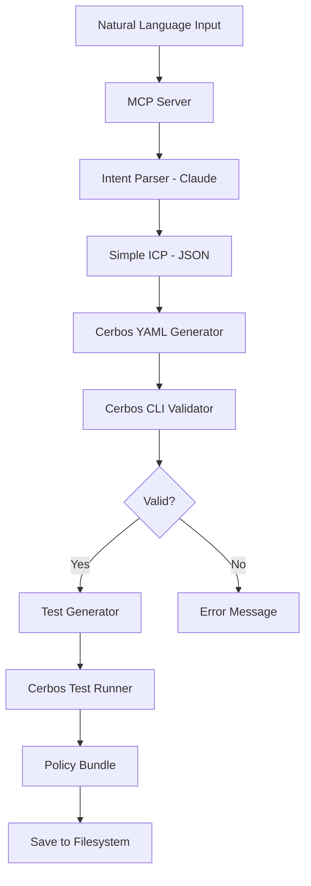

# GlassTape Agent Policy Builder: MVP Technical Implementation

**Version 1.0 - MVP Launch Edition (Python)**  
*Simplified MCP Server Architecture for Cerbos Policy Generation*

---

## Table of Contents

1. [Executive Overview](#executive-overview)
2. [MVP Scope & Principles](#mvp-scope--principles)
3. [System Architecture](#system-architecture)
4. [Simple ICP Format](#simple-icp-format)
5. [Core Components](#core-components)
6. [MCP Tool Implementation](#mcp-tool-implementation)
7. [Cerbos Integration](#cerbos-integration)
8. [Template Library](#template-library)
9. [Testing Strategy](#testing-strategy)
10. [Deployment Guide](#deployment-guide)
11. [Phase Roadmap](#phase-roadmap)

---

## Executive Overview

### What This Is

The **GlassTape Agent Policy Builder** MVP is a lightweight MCP server written in **Python** that converts natural language security requirements into **validated Cerbos YAML policies**. It focuses on core functionality: generation, validation, and basic security analysis.

### MVP Philosophy

**Do One Thing Well**: Generate production-ready Cerbos policies from natural language, with automated validation and testing.

**What We ARE Building**:
- ✅ Natural language → Cerbos YAML
- ✅ Automated validation (cerbos compile)
- ✅ Test generation & execution
- ✅ Basic red-team analysis (5 checks)
- ✅ Template library (5 templates)
- ✅ Local-first, air-gap capable

### Technology Stack

```
MCP Client (Claude, Cursor, Zed, Q)
    │
    │ Client's LLM converts NL → ICP JSON
    ↓
MCP Protocol (stdio)
    ↓
Python 3.10+ Server (LLM-agnostic)
    ↓
Simple ICP (JSON) Validation
    ↓
Cerbos YAML Generator
    ↓
Cerbos CLI (local binary)
    ↓
Policy Bundle (YAML + Tests)

Optional: Server-side LLM adapter
(Anthropic/Bedrock/OpenAI)
```

**Core Dependencies:**
- Python 3.10+
- `mcp` - MCP SDK for Python
- `pyyaml` - YAML processing
- `cerbos` CLI (local binary)

**Optional Dependencies:**
- `anthropic` - For server-side NL parsing (if LLM_PROVIDER=anthropic)
- `boto3` - For AWS Bedrock (if LLM_PROVIDER=bedrock)
- `openai` - For OpenAI (if LLM_PROVIDER=openai)

---

## MVP Scope & Principles

### Core Functionality Matrix

| Feature | MVP Status | Notes |
|---------|-----------|-------|
| ICP validation | ✅ Launch | JSON schema validation |
| Cerbos YAML generation | ✅ Launch | ICP → Cerbos conversion |
| Policy validation | ✅ Launch | `cerbos compile` |
| Test generation | ✅ Launch | Positive + negative cases |
| Test execution | ✅ Launch | `cerbos test` |
| Basic red-team | ✅ Launch | 5 essential checks (static) |
| Template library | ✅ Launch | 5 core templates |
| Client-side NL parsing | ✅ Launch | Via MCP client's LLM |
| Server-side NL parsing | ⚠️ Optional | Via LLM adapter (env-gated) |


### Design Principles

1. **Simplicity First** - Flat data structures, linear flow
2. **Local-First** - Air-gap capable, no cloud dependencies
3. **Deterministic** - Same input → same output
4. **Extensible** - Easy to add features in Phase 2
5. **Developer-Friendly** - Clear errors, helpful messages
6. **Pythonic** - Follow Python best practices and idioms
7. **LLM-Agnostic** - Works with any MCP client's LLM

---

## Operational Modes

The Policy Builder supports two runtime modes:

### Mode 1: Client-LLM (Default, Recommended)

**How it works:**
1. MCP client (Cursor/Claude/Q) uses its own LLM to convert natural language → ICP JSON
2. Client calls `generate_policy` with `icp` parameter
3. Server performs deterministic transforms: ICP → Cerbos YAML → Validation → Tests
4. **No cloud dependencies, fully air-gapped**

**Benefits:**
- ✅ No API keys required
- ✅ Works offline (if client uses local LLM)
- ✅ Works with any MCP client
- ✅ Better security posture
- ✅ Simpler deployment

**Client-side prompt** (for IDE to generate ICP):
```
You are a policy normalizer. Convert the user's natural language requirements
into ICP JSON for Cerbos generation. Output ONLY valid JSON matching this schema:

{
  "version": "1.0.0",
  "metadata": {
    "name": "snake_case_name",
    "description": "what it does",
    "resource": "resource_kind",
    "compliance": ["SOX","HIPAA","PCI-DSS","GDPR"],
    "tags": ["ai","guardrail","risk-high"]
  },
  "policy": {
    "resource": "resource_kind",
    "version": "1.0.0",
    "rules": [
      {
        "actions": ["execute"],
        "effect": "EFFECT_ALLOW",
        "roles": ["agent","service"],
        "conditions": [
          "request.resource.attr.amount > 0",
          "request.resource.attr.amount <= 50"
        ],
        "description": "Allow with constraints"
      },
      {
        "actions": ["*"],
        "effect": "EFFECT_DENY",
        "conditions": [],
        "description": "Default deny"
      }
    ]
  },
  "tests": [
    {"name":"valid","category":"positive","input":{...},"expected":"EFFECT_ALLOW"},
    {"name":"invalid","category":"negative","input":{...},"expected":"EFFECT_DENY"}
  ]
}
```

### Mode 2: Server-LLM (Optional)

**How it works:**
1. User provides natural language requirements
2. Server uses configured LLM adapter (Anthropic/Bedrock/OpenAI) to generate ICP
3. Server continues with deterministic transforms

**Requires:**
```bash
export LLM_PROVIDER=anthropic  # or bedrock, openai
export ANTHROPIC_API_KEY=sk-ant-...  # or AWS_* credentials, OPENAI_API_KEY
```

**Benefits:**
- ✅ One-step workflow from natural language
- ✅ Good for teams without LLM-capable IDE

**Trade-offs:**
- ⚠️ Requires API keys
- ⚠️ Network dependency
- ⚠️ Additional secrets to manage

### Choosing a Mode

**Use Client-LLM mode if:**
- Using Cursor, Claude Desktop, or Q with LLM capabilities
- Want fully air-gapped operation
- Prefer not to manage API keys
- Need maximum security

**Use Server-LLM mode if:**
- Using basic IDEs without LLM
- Want simpler client integration
- Already have LLM API infrastructure

---

## System Architecture

### High-Level Flow



### Component Architecture

```
┌─────────────────────────────────────────────────────────┐
│                    MCP Server Core                       │
│                     (Python 3.10+)                       │
├─────────────────────────────────────────────────────────┤
│                                                          │
│  ┌──────────────────────────────────────────────────┐  │
│  │              Tool Handler (5 tools)              │  │
│  │  • generate_policy                               │  │
│  │  • validate_policy                               │  │
│  │  • test_policy                                   │  │
│  │  • suggest_improvements                          │  │
│  │  • list_templates                                │  │
│  └──────────────────────────────────────────────────┘  │
│                                                          │
│  ┌──────────────────────────────────────────────────┐  │
│  │            Natural Language Parser               │  │
│  │         (Anthropic Claude Integration)           │  │
│  └──────────────────────────────────────────────────┘  │
│                                                          │
│  ┌──────────────────────────────────────────────────┐  │
│  │             Simple ICP Generator                 │  │
│  │          (Flat Dict Structure)                   │  │
│  └──────────────────────────────────────────────────┘  │
│                                                          │
│  ┌──────────────────────────────────────────────────┐  │
│  │           Cerbos YAML Generator                  │  │
│  │        (ICP → Cerbos YAML Converter)             │  │
│  └──────────────────────────────────────────────────┘  │
│                                                          │
│  ┌──────────────────────────────────────────────────┐  │
│  │              Cerbos CLI Interface                │  │
│  │         (compile, test commands)                 │  │
│  └──────────────────────────────────────────────────┘  │
│                                                          │
│  ┌──────────────────────────────────────────────────┐  │
│  │          Simple Red-Team Analyzer                │  │
│  │            (5 Basic Checks)                      │  │
│  └──────────────────────────────────────────────────┘  │
│                                                          │
│  ┌──────────────────────────────────────────────────┐  │
│  │             Template Library                     │  │
│  │          (5 Pre-built Templates)                 │  │
│  └──────────────────────────────────────────────────┘  │
│                                                          │
└─────────────────────────────────────────────────────────┘
                          ↓
                   Local Filesystem
              /var/glasstape/policies/
```

### Data Flow

**Mode 1: Client-LLM (Default)**
```
1. User Input (Natural Language)
   ↓
2. MCP Client's LLM (Cursor/Claude/Q)
   ↓
3. ICP JSON generated by client
   ↓
4. MCP call: generate_policy(icp={...})
   ↓
5. Server: ICP Validation
   ↓
6. Server: Cerbos YAML Generation
   ↓
7. Server: cerbos compile (validation)
   ↓
8. Server: Test Generation (from ICP tests)
   ↓
9. Server: cerbos test (execution)
   ↓
10. Policy Bundle (YAML + Tests)
```

**Mode 2: Server-LLM (Optional)**
```
1. User Input (Natural Language)
   ↓
2. MCP call: generate_policy(nl_requirements="...")
   ↓
3. Server: LLM Adapter (if configured)
   ↓
4. Server: ICP Generation
   ↓
5. Server: ICP Validation
   ↓
6. Server: Cerbos YAML Generation
   ↓
7-10. Same as Mode 1
```

**ICP Example:**
```python
{
  "version": "1.0.0",
  "metadata": {
    "name": "payment_policy",
    "resource": "payment",
    "description": "Payment execution policy"
  },
  "policy": {
    "resource": "payment",
    "version": "1.0.0",
    "rules": [{
      "actions": ["execute"],
      "effect": "EFFECT_ALLOW",
      "conditions": ["amount <= 50", "!(recipient in sanctioned_entities)"]
    }]
  },
  "tests": [...]
}
```

**Generated Cerbos YAML:**
```yaml
apiVersion: api.cerbos.dev/v1
resourcePolicy:
  resource: payment
  rules:
    - actions: [execute]
      effect: EFFECT_ALLOW
      condition:
        match:
          expr: "(amount <= 50) && (!(recipient in sanctioned_entities))"
```

---

## Simple ICP Format

### Design Rationale

The **Simple ICP** (Intermediate Canonical Policy) uses a flat structure instead of complex nested expression trees. This makes it:
- ✅ Easier for LLMs to generate
- ✅ Simpler to convert to Cerbos YAML
- ✅ More readable for debugging
- ✅ Still deterministic and testable
- ✅ Natural for Python dictionaries

### ICP Schema (Python)

```python
# src/agent_policy_builder/types.py

from dataclasses import dataclass, field
from typing import Optional, Literal

@dataclass
class ICPMetadata:
    """Policy metadata"""
    name: str
    description: str
    resource: str
    compliance: list[str] = field(default_factory=list)
    tags: list[str] = field(default_factory=list)

@dataclass
class ICPRule:
    """Policy rule definition"""
    actions: list[str]
    effect: Literal['EFFECT_ALLOW', 'EFFECT_DENY']
    conditions: list[str]  # Simple string expressions
    roles: list[str] = field(default_factory=list)
    description: str = ""

@dataclass
class ICPPolicy:
    """Policy definition"""
    resource: str
    version: str
    rules: list[ICPRule]

@dataclass
class ICPTestInput:
    """Test case input"""
    principal: dict  # {"id": "...", "roles": [...]}
    resource: dict   # {"id": "...", "attr": {...}}
    actions: list[str]

@dataclass
class ICPTest:
    """Policy test case"""
    name: str
    category: Literal['positive', 'negative', 'boundary', 'adversarial']
    input: ICPTestInput
    expected: Literal['EFFECT_ALLOW', 'EFFECT_DENY']
    description: str = ""

@dataclass
class SimpleICP:
    """Complete policy specification"""
    version: str
    metadata: ICPMetadata
    policy: ICPPolicy
    tests: list[ICPTest]
```

### Example: Payment Policy ICP

```python
{
    "version": "1.0.0",
    "metadata": {
        "name": "payment_policy",
        "description": "AI agent payment execution policy with amount limits and sanctions screening",
        "resource": "payment",
        "compliance": ["SOX"],
        "tags": ["finance", "payments", "ai-agent"]
    },
    "policy": {
        "resource": "payment",
        "version": "1.0.0",
        "rules": [
            {
                "actions": ["execute"],
                "effect": "EFFECT_ALLOW",
                "roles": ["ai_agent"],
                "conditions": [
                    "request.resource.attr.amount > 0",
                    "request.resource.attr.amount <= 50",
                    "!(request.resource.attr.recipient in request.resource.attr.sanctioned_entities)",
                    "(request.resource.attr.cumulative_amount_last_hour + request.resource.attr.amount) <= 50",
                    "request.resource.attr.agent_txn_count_5m < 5"
                ],
                "description": "Allow payment execution with amount limits, sanctions check, and rate limiting"
            },
            {
                "actions": ["*"],
                "effect": "EFFECT_DENY",
                "conditions": [],
                "description": "Default deny all other actions"
            }
        ]
    },
    "tests": [
        {
            "name": "valid_payment_allowed",
            "description": "Valid payment under all limits should be allowed",
            "category": "positive",
            "input": {
                "principal": {
                    "id": "agent-123",
                    "roles": ["ai_agent"]
                },
                "resource": {
                    "id": "payment-456",
                    "attr": {
                        "amount": 30,
                        "recipient": "vendor@example.com",
                        "sanctioned_entities": ["evil@bad.com"],
                        "cumulative_amount_last_hour": 10,
                        "agent_txn_count_5m": 2
                    }
                },
                "actions": ["execute"]
            },
            "expected": "EFFECT_ALLOW"
        },
        {
            "name": "excessive_amount_denied",
            "description": "Payment exceeding $50 limit should be denied",
            "category": "negative",
            "input": {
                "principal": {
                    "id": "agent-123",
                    "roles": ["ai_agent"]
                },
                "resource": {
                    "id": "payment-789",
                    "attr": {
                        "amount": 100,
                        "recipient": "vendor@example.com",
                        "sanctioned_entities": [],
                        "cumulative_amount_last_hour": 0,
                        "agent_txn_count_5m": 0
                    }
                },
                "actions": ["execute"]
            },
            "expected": "EFFECT_DENY"
        },
        {
            "name": "sanctioned_entity_denied",
            "description": "Payment to sanctioned entity should be denied",
            "category": "negative",
            "input": {
                "principal": {
                    "id": "agent-123",
                    "roles": ["ai_agent"]
                },
                "resource": {
                    "id": "payment-999",
                    "attr": {
                        "amount": 25,
                        "recipient": "evil@bad.com",
                        "sanctioned_entities": ["evil@bad.com"],
                        "cumulative_amount_last_hour": 0,
                        "agent_txn_count_5m": 0
                    }
                },
                "actions": ["execute"]
            },
            "expected": "EFFECT_DENY"
        }
    ]
}
```

---

## Core Components

### 1. MCP Server Core

**File**: `src/agent_policy_builder/server.py`

```python
"""
GlassTape Agent Policy Builder MCP Server

Main server implementation for the MCP protocol.
LLM-agnostic design - works with client's LLM by default.
"""

import asyncio
from mcp.server import Server
from mcp.server.stdio import stdio_server

from .tools import register_tools


async def main():
    """Run the MCP server"""
    
    # Create server
    server = Server("agent-policy-builder")
    
    # Register all tools
    # No API key required - tools work with ICP JSON input by default
    await register_tools(server)
    
    # Run server with stdio transport
    async with stdio_server() as (read_stream, write_stream):
        await server.run(
            read_stream,
            write_stream,
            server.create_initialization_options()
        )


if __name__ == "__main__":
    asyncio.run(main())
```

---

### 2. ICP Validator (Core)

**File**: `src/agent_policy_builder/icp_validator.py`

```python
"""
ICP Validator

Validates Simple ICP JSON structure without requiring any LLM.
"""

import json
from typing import Any


class ICPValidator:
    """Validate Simple ICP structure"""
    
    def validate(self, icp: dict) -> None:
        """
        Validate ICP structure
        
        Args:
            icp: Simple ICP dictionary
            
        Raises:
            ValueError: If ICP is invalid
        """
        if not isinstance(icp, dict):
            raise ValueError("ICP must be a dictionary")
        
        # Check version
        if icp.get('version') != '1.0.0':
            raise ValueError("ICP version must be 1.0.0")
        
        # Check required sections
        if 'metadata' not in icp:
            raise ValueError("ICP must have 'metadata' section")
        if 'policy' not in icp:
            raise ValueError("ICP must have 'policy' section")
        if 'tests' not in icp:
            raise ValueError("ICP must have 'tests' section")
        
        # Validate metadata
        self._validate_metadata(icp['metadata'])
        
        # Validate policy
        self._validate_policy(icp['policy'])
        
        # Validate tests
        self._validate_tests(icp['tests'])
    
    def _validate_metadata(self, metadata: dict) -> None:
        """Validate metadata section"""
        required_fields = ['name', 'description', 'resource']
        for field in required_fields:
            if field not in metadata:
                raise ValueError(f"Metadata missing required field: {field}")
        
        # Name should be snake_case
        name = metadata['name']
        if not name.replace('_', '').isalnum():
            raise ValueError(f"Metadata name should be snake_case: {name}")
        
        # Compliance should be array if present
        if 'compliance' in metadata and not isinstance(metadata['compliance'], list):
            raise ValueError("Metadata compliance must be an array")
    
    def _validate_policy(self, policy: dict) -> None:
        """Validate policy section"""
        if 'resource' not in policy:
            raise ValueError("Policy missing 'resource' field")
        if 'version' not in policy:
            raise ValueError("Policy missing 'version' field")
        if 'rules' not in policy:
            raise ValueError("Policy missing 'rules' field")
        
        rules = policy['rules']
        if not isinstance(rules, list) or len(rules) == 0:
            raise ValueError("Policy must have at least one rule")
        
        # Validate each rule
        for i, rule in enumerate(rules):
            self._validate_rule(rule, i)
        
        # Check for default deny rule
        last_rule = rules[-1]
        if last_rule.get('effect') != 'EFFECT_DENY' or '*' not in last_rule.get('actions', []):
            raise ValueError("Policy should end with a default deny rule (actions: ['*'], effect: EFFECT_DENY)")
    
    def _validate_rule(self, rule: dict, index: int) -> None:
        """Validate a single rule"""
        required_fields = ['actions', 'effect']
        for field in required_fields:
            if field not in rule:
                raise ValueError(f"Rule {index} missing required field: {field}")
        
        # Validate effect
        if rule['effect'] not in ['EFFECT_ALLOW', 'EFFECT_DENY']:
            raise ValueError(f"Rule {index} effect must be EFFECT_ALLOW or EFFECT_DENY")
        
        # Validate actions
        if not isinstance(rule['actions'], list) or len(rule['actions']) == 0:
            raise ValueError(f"Rule {index} actions must be a non-empty array")
        
        # Validate conditions if present
        if 'conditions' in rule:
            if not isinstance(rule['conditions'], list):
                raise ValueError(f"Rule {index} conditions must be an array")
    
    def _validate_tests(self, tests: list) -> None:
        """Validate tests section"""
        if not isinstance(tests, list):
            raise ValueError("Tests must be an array")
        
        if len(tests) < 2:
            raise ValueError("Must have at least 2 test cases (1 positive, 1 negative)")
        
        # Check for at least one positive and one negative test
        has_positive = any(t.get('category') == 'positive' for t in tests)
        has_negative = any(t.get('category') == 'negative' for t in tests)
        
        if not has_positive:
            raise ValueError("Must have at least one positive test case")
        if not has_negative:
            raise ValueError("Must have at least one negative test case")
        
        # Validate each test
        for i, test in enumerate(tests):
            self._validate_test(test, i)
    
    def _validate_test(self, test: dict, index: int) -> None:
        """Validate a single test case"""
        required_fields = ['name', 'category', 'input', 'expected']
        for field in required_fields:
            if field not in test:
                raise ValueError(f"Test {index} missing required field: {field}")
        
        # Validate category
        valid_categories = ['positive', 'negative', 'boundary', 'adversarial']
        if test['category'] not in valid_categories:
            raise ValueError(f"Test {index} category must be one of: {valid_categories}")
        
        # Validate expected
        if test['expected'] not in ['EFFECT_ALLOW', 'EFFECT_DENY']:
            raise ValueError(f"Test {index} expected must be EFFECT_ALLOW or EFFECT_DENY")
        
        # Validate input structure
        test_input = test['input']
        if 'principal' not in test_input:
            raise ValueError(f"Test {index} input missing 'principal'")
        if 'resource' not in test_input:
            raise ValueError(f"Test {index} input missing 'resource'")
        if 'actions' not in test_input:
            raise ValueError(f"Test {index} input missing 'actions'")


# Example usage
if __name__ == "__main__":
    validator = ICPValidator()
    
    valid_icp = {
        "version": "1.0.0",
        "metadata": {
            "name": "test_policy",
            "description": "Test",
            "resource": "test"
        },
        "policy": {
            "resource": "test",
            "version": "1.0.0",
            "rules": [
                {
                    "actions": ["read"],
                    "effect": "EFFECT_ALLOW",
                    "conditions": []
                },
                {
                    "actions": ["*"],
                    "effect": "EFFECT_DENY",
                    "conditions": []
                }
            ]
        },
        "tests": [
            {
                "name": "allow_read",
                "category": "positive",
                "input": {
                    "principal": {"id": "user", "roles": []},
                    "resource": {"id": "doc", "attr": {}},
                    "actions": ["read"]
                },
                "expected": "EFFECT_ALLOW"
            },
            {
                "name": "deny_write",
                "category": "negative",
                "input": {
                    "principal": {"id": "user", "roles": []},
                    "resource": {"id": "doc", "attr": {}},
                    "actions": ["write"]
                },
                "expected": "EFFECT_DENY"
            }
        ]
    }
    
    try:
        validator.validate(valid_icp)
        print("✓ ICP is valid")
    except ValueError as e:
        print(f"✗ Invalid ICP: {e}")
```

---

### 3. LLM Adapter (Optional)

**File**: `src/agent_policy_builder/llm_adapter.py`

```python
"""
Optional LLM Adapter

Provider-agnostic interface for NL → ICP conversion.
Only loaded if LLM_PROVIDER environment variable is set.
"""

import os
import json
import re
from abc import ABC, abstractmethod
from typing import Optional


class LLMAdapter(ABC):
    """Abstract interface for LLM providers"""
    
    @abstractmethod
    def nl_to_icp(self, nl_requirements: str) -> dict:
        """Convert natural language to ICP JSON"""
        pass
    
    @abstractmethod
    def suggest_improvements(self, policy_yaml: str) -> list[str]:
        """Suggest policy improvements using LLM"""
        pass


class AnthropicAdapter(LLMAdapter):
    """Anthropic Claude adapter"""
    
    def __init__(self, api_key: str):
        from anthropic import Anthropic
        self.client = Anthropic(api_key=api_key)
    
    def nl_to_icp(self, nl_requirements: str) -> dict:
        """Convert NL to ICP using Claude"""
        response = self.client.messages.create(
            model="claude-sonnet-4-5-20250929",
            max_tokens=8192,
            system=self._get_system_prompt(),
            messages=[{
                "role": "user",
                "content": f"Generate ICP JSON for:\n\n{nl_requirements}"
            }]
        )
        
        text = response.content[0].text
        json_str = self._extract_json(text)
        return json.loads(json_str)
    
    def suggest_improvements(self, policy_yaml: str) -> list[str]:
        """Suggest improvements using Claude"""
        response = self.client.messages.create(
            model="claude-sonnet-4-5-20250929",
            max_tokens=2048,
            messages=[{
                "role": "user",
                "content": f"Suggest security improvements for this Cerbos policy:\n\n```yaml\n{policy_yaml}\n```\n\nProvide 3-5 specific improvements as a bullet list."
            }]
        )
        
        text = response.content[0].text
        # Extract bullet points
        suggestions = [line.strip('- ').strip() for line in text.split('\n') if line.strip().startswith('-')]
        return suggestions
    
    def _get_system_prompt(self) -> str:
        """System prompt for ICP generation"""
        return """You are a policy normalizer. Convert natural language requirements
into ICP JSON for Cerbos generation. Output ONLY valid JSON matching this schema:

{
  "version": "1.0.0",
  "metadata": {
    "name": "snake_case_name",
    "description": "what it does",
    "resource": "resource_kind",
    "compliance": ["SOX","HIPAA","PCI-DSS","GDPR"],
    "tags": ["ai","guardrail"]
  },
  "policy": {
    "resource": "resource_kind",
    "version": "1.0.0",
    "rules": [
      {
        "actions": ["execute"],
        "effect": "EFFECT_ALLOW",
        "roles": ["agent"],
        "conditions": [
          "request.resource.attr.amount > 0",
          "request.resource.attr.amount <= 50"
        ],
        "description": "Allow with constraints"
      },
      {
        "actions": ["*"],
        "effect": "EFFECT_DENY",
        "conditions": [],
        "description": "Default deny"
      }
    ]
  },
  "tests": [
    {"name":"valid","category":"positive","input":{...},"expected":"EFFECT_ALLOW"},
    {"name":"invalid","category":"negative","input":{...},"expected":"EFFECT_DENY"}
  ]
}

Always include:
- A default deny rule as the last rule
- At least 2 tests (1 positive, 1 negative)
- Simple string conditions (not nested expressions)
"""
    
    def _extract_json(self, text: str) -> str:
        """Extract JSON from response"""
        code_block = re.search(r'```(?:json)?\s*(\{.*?\})\s*```', text, re.DOTALL)
        if code_block:
            return code_block.group(1)
        
        json_match = re.search(r'\{.*\}', text, re.DOTALL)
        if json_match:
            return json_match.group(0)
        
        raise ValueError("No JSON found in LLM response")


def get_llm_adapter() -> Optional[LLMAdapter]:
    """
    Get LLM adapter based on environment configuration
    
    Returns:
        LLMAdapter instance or None if not configured
    """
    provider = os.getenv('LLM_PROVIDER')
    
    if not provider:
        return None
    
    if provider == 'anthropic':
        api_key = os.getenv('ANTHROPIC_API_KEY')
        if not api_key:
            raise ValueError("LLM_PROVIDER=anthropic requires ANTHROPIC_API_KEY")
        return AnthropicAdapter(api_key)
    
    elif provider == 'bedrock':
        # Future: AWS Bedrock adapter
        raise NotImplementedError("Bedrock adapter coming in Phase 2")
    
    elif provider == 'openai':
        # Future: OpenAI adapter
        raise NotImplementedError("OpenAI adapter coming in Phase 2")
    
    else:
        raise ValueError(f"Unknown LLM_PROVIDER: {provider}")


# Example usage
if __name__ == "__main__":
    adapter = get_llm_adapter()
    
    if adapter:
        print("✓ LLM adapter configured")
        icp = adapter.nl_to_icp("Allow payments up to $50")
        print(json.dumps(icp, indent=2))
    else:
        print("✗ No LLM adapter configured (this is fine for client-LLM mode)")
```

---

### 4. Cerbos YAML Generator

### 4. Cerbos YAML Generator

**File**: `src/agent_policy_builder/cerbos_generator.py`

```python
"""
Cerbos YAML Generator

Converts Simple ICP to Cerbos YAML format.
"""

import yaml


class CerbosGenerator:
    """Generate Cerbos YAML from Simple ICP"""
    
    def generate_policy(self, icp: dict) -> str:
        """
        Convert ICP to Cerbos policy YAML
        
        Args:
            icp: Simple ICP dictionary
            
        Returns:
            Cerbos policy YAML string
        """
        policy = {
            'apiVersion': 'api.cerbos.dev/v1',
            'description': icp['metadata']['description'],
            'resourcePolicy': {
                'version': icp['policy']['version'],
                'resource': icp['policy']['resource'],
                'rules': [self._transform_rule(rule) for rule in icp['policy']['rules']]
            }
        }
        
        return yaml.dump(policy, default_flow_style=False, sort_keys=False)
    
    def generate_tests(self, icp: dict) -> str:
        """
        Convert ICP tests to Cerbos test YAML
        
        Args:
            icp: Simple ICP dictionary
            
        Returns:
            Cerbos test YAML string
        """
        test_suite = {
            'name': f"{icp['metadata']['name']}_test_suite",
            'description': f"Test suite for {icp['metadata']['name']}",
            'tests': [self._transform_test(test, icp) for test in icp['tests']]
        }
        
        return yaml.dump(test_suite, default_flow_style=False, sort_keys=False)
    
    def _transform_rule(self, rule: dict) -> dict:
        """Transform ICP rule to Cerbos rule"""
        cerbos_rule = {
            'actions': rule['actions'],
            'effect': rule['effect']
        }
        
        # Add roles if specified
        if rule.get('roles'):
            cerbos_rule['roles'] = rule['roles']
        
        # Add conditions if specified
        if rule.get('conditions'):
            cerbos_rule['condition'] = {
                'match': {
                    'expr': self._build_expr(rule['conditions'])
                }
            }
        
        return cerbos_rule
    
    def _transform_test(self, test: dict, icp: dict) -> dict:
        """Transform ICP test to Cerbos test"""
        return {
            'name': test['name'],
            'input': {
                'principal': test['input']['principal']['id'],
                'resource': {
                    'kind': icp['policy']['resource'],
                    'id': test['input']['resource']['id'],
                    'attr': test['input']['resource']['attr']
                },
                'actions': test['input']['actions']
            },
            'expected': [
                {
                    'action': action,
                    'effect': test['expected']
                }
                for action in test['input']['actions']
            ]
        }
    
    def _build_expr(self, conditions: list[str]) -> str:
        """Build CEL expression from conditions"""
        # Join conditions with AND, wrapping each in parentheses
        return ' && '.join(f'({c})' for c in conditions)


# Example usage
if __name__ == "__main__":
    generator = CerbosGenerator()
    
    sample_icp = {
        "version": "1.0.0",
        "metadata": {
            "name": "payment_policy",
            "description": "Payment policy"
        },
        "policy": {
            "resource": "payment",
            "version": "1.0.0",
            "rules": [{
                "actions": ["execute"],
                "effect": "EFFECT_ALLOW",
                "conditions": ["amount <= 50"]
            }]
        },
        "tests": []
    }
    
    print(generator.generate_policy(sample_icp))
```

---

### 5. Cerbos CLI Interface

**File**: `src/agent_policy_builder/cerbos_cli.py`

```python
"""
Cerbos CLI Interface

Wrapper for executing Cerbos CLI commands.
"""

import subprocess
import tempfile
import re
from pathlib import Path
from dataclasses import dataclass


@dataclass
class ValidationResult:
    """Result of policy validation"""
    success: bool
    errors: list[str]
    warnings: list[str]


@dataclass
class TestResult:
    """Result of test execution"""
    passed: int
    failed: int
    total: int
    details: str


class CerbosCLI:
    """Interface to Cerbos CLI for validation and testing"""
    
    def __init__(self, work_dir: str = None):
        self.work_dir = Path(work_dir or tempfile.gettempdir()) / "glasstape-policies"
    
    def check_installation(self) -> bool:
        """Check if Cerbos CLI is installed"""
        try:
            result = subprocess.run(
                ['cerbos', 'version'],
                capture_output=True,
                text=True,
                timeout=5
            )
            return result.returncode == 0
        except (subprocess.TimeoutExpired, FileNotFoundError):
            return False
    
    def compile(self, policy_yaml: str) -> ValidationResult:
        """
        Validate policy with cerbos compile
        
        Args:
            policy_yaml: Cerbos policy YAML string
            
        Returns:
            ValidationResult with success status and any errors/warnings
        """
        try:
            # Create working directory
            self.work_dir.mkdir(parents=True, exist_ok=True)
            
            # Write policy to file
            policy_file = self.work_dir / "policy.yaml"
            policy_file.write_text(policy_yaml)
            
            # Run cerbos compile
            result = subprocess.run(
                ['cerbos', 'compile', str(self.work_dir)],
                capture_output=True,
                text=True,
                timeout=30
            )
            
            output = result.stdout + result.stderr
            
            # Check for errors
            if 'error' in output.lower() or result.returncode != 0:
                return ValidationResult(
                    success=False,
                    errors=self._extract_errors(output),
                    warnings=self._extract_warnings(output)
                )
            
            return ValidationResult(
                success=True,
                errors=[],
                warnings=self._extract_warnings(output)
            )
            
        except subprocess.TimeoutExpired:
            return ValidationResult(
                success=False,
                errors=["Validation timeout - policy compilation took too long"],
                warnings=[]
            )
        except Exception as e:
            return ValidationResult(
                success=False,
                errors=[f"Validation error: {str(e)}"],
                warnings=[]
            )
    
    def test(self, policy_yaml: str, test_yaml: str) -> TestResult:
        """
        Run tests with cerbos test
        
        Args:
            policy_yaml: Cerbos policy YAML string
            test_yaml: Cerbos test suite YAML string
            
        Returns:
            TestResult with pass/fail counts and details
        """
        try:
            # Setup files
            self.work_dir.mkdir(parents=True, exist_ok=True)
            (self.work_dir / "policy.yaml").write_text(policy_yaml)
            (self.work_dir / "test.yaml").write_text(test_yaml)
            
            # Run cerbos test
            result = subprocess.run(
                ['cerbos', 'test', str(self.work_dir)],
                capture_output=True,
                text=True,
                timeout=60
            )
            
            return self._parse_test_output(result.stdout)
            
        except subprocess.TimeoutExpired:
            raise RuntimeError("Test execution timeout")
        except Exception as e:
            raise RuntimeError(f"Test execution failed: {str(e)}")
    
    def _extract_errors(self, output: str) -> list[str]:
        """Extract error messages from Cerbos output"""
        errors = []
        for line in output.split('\n'):
            if 'error' in line.lower():
                errors.append(line.strip())
        return errors
    
    def _extract_warnings(self, output: str) -> list[str]:
        """Extract warning messages from Cerbos output"""
        warnings = []
        for line in output.split('\n'):
            if 'warn' in line.lower():
                warnings.append(line.strip())
        return warnings
    
    def _parse_test_output(self, output: str) -> TestResult:
        """Parse Cerbos test output"""
        # Parse "X passed, Y failed" format
        passed_match = re.search(r'(\d+) passed', output)
        failed_match = re.search(r'(\d+) failed', output)
        
        passed = int(passed_match.group(1)) if passed_match else 0
        failed = int(failed_match.group(1)) if failed_match else 0
        
        return TestResult(
            passed=passed,
            failed=failed,
            total=passed + failed,
            details=output
        )


# Example usage
if __name__ == "__main__":
    cli = CerbosCLI()
    
    if cli.check_installation():
        print("✓ Cerbos CLI is installed")
    else:
        print("✗ Cerbos CLI not found")
```

---

### 6. Simple Red-Team Analyzer

**File**: `src/agent_policy_builder/redteam_analyzer.py`

```python
"""
Simple Red-Team Analyzer

Performs 5 essential security checks on policies.
"""

from dataclasses import dataclass
from typing import Literal


@dataclass
class RedTeamFinding:
    """Security analysis finding"""
    check: str
    status: Literal['pass', 'warn', 'fail']
    message: str


class SimpleRedTeamAnalyzer:
    """Analyze policies for common security issues"""
    
    def analyze(self, policy_yaml: str, icp: dict = None) -> list[RedTeamFinding]:
        """
        Run 5 essential security checks
        
        Args:
            policy_yaml: Cerbos policy YAML string
            icp: Optional Simple ICP dictionary for deeper analysis
            
        Returns:
            List of security findings
        """
        findings = []
        
        # Check 1: Default-deny principle
        findings.append(self._check_default_deny(icp or {}, policy_yaml))
        
        # Check 2: Rate limiting
        findings.append(self._check_rate_limiting(policy_yaml))
        
        # Check 3: Sanctions screening
        findings.append(self._check_sanctions_screening(policy_yaml))
        
        # Check 4: Input validation
        findings.append(self._check_input_validation(policy_yaml))
        
        # Check 5: Role-based access
        findings.append(self._check_role_based_access(icp or {}, policy_yaml))
        
        return findings
    
    def format_findings(self, findings: list[RedTeamFinding]) -> str:
        """Format findings as readable text"""
        output = "## Security Analysis Results\n\n"
        
        passed = sum(1 for f in findings if f.status == 'pass')
        warned = sum(1 for f in findings if f.status == 'warn')
        failed = sum(1 for f in findings if f.status == 'fail')
        
        output += f"**Score**: {passed}/5 checks passed\n\n"
        
        for finding in findings:
            output += f"### {finding.check}\n"
            output += f"{finding.message}\n\n"
        
        if failed > 0:
            output += '⚠️ **Action Required**: Address failed checks before deployment\n'
        elif warned > 0:
            output += '💡 **Recommendations**: Consider addressing warnings to improve security\n'
        else:
            output += '✅ **Ready for Deployment**: All security checks passed\n'
        
        return output
    
    def _check_default_deny(self, icp: dict, policy_yaml: str) -> RedTeamFinding:
        """Check for default-deny principle"""
        if icp and 'policy' in icp and 'rules' in icp['policy']:
            rules = icp['policy']['rules']
            if rules:
                last_rule = rules[-1]
                if (last_rule.get('effect') == 'EFFECT_DENY' and 
                    '*' in last_rule.get('actions', [])):
                    return RedTeamFinding(
                        check='Default Deny',
                        status='pass',
                        message='✓ Policy implements default-deny principle'
                    )
        
        return RedTeamFinding(
            check='Default Deny',
            status='fail',
            message='✗ Missing default-deny rule. Add a final rule with effect: EFFECT_DENY and actions: ["*"]'
        )
    
    def _check_rate_limiting(self, policy_yaml: str) -> RedTeamFinding:
        """Check for rate limiting controls"""
        rate_keywords = ['cumulative', 'count', 'rate', 'frequency', 'limit']
        has_rate_limit = any(keyword in policy_yaml.lower() for keyword in rate_keywords)
        
        if has_rate_limit:
            return RedTeamFinding(
                check='Rate Limiting',
                status='pass',
                message='✓ Rate limiting controls detected'
            )
        
        return RedTeamFinding(
            check='Rate Limiting',
            status='warn',
            message='⚠ No rate limiting detected. Consider adding cumulative amount or transaction frequency limits'
        )
    
    def _check_sanctions_screening(self, policy_yaml: str) -> RedTeamFinding:
        """Check for sanctions/blocklist screening"""
        sanction_keywords = ['sanction', 'blocked', 'blocklist', 'blacklist']
        has_sanctions = any(keyword in policy_yaml.lower() for keyword in sanction_keywords)
        
        if has_sanctions:
            return RedTeamFinding(
                check='Sanctions Screening',
                status='pass',
                message='✓ Sanctions/blocklist screening detected'
            )
        
        return RedTeamFinding(
            check='Sanctions Screening',
            status='warn',
            message='⚠ No sanctions screening detected. Consider adding entity screening against blocked lists'
        )
    
    def _check_input_validation(self, policy_yaml: str) -> RedTeamFinding:
        """Check for input validation"""
        validation_patterns = ['> 0', '>= 0', '!= null', 'typeof']
        has_validation = any(pattern in policy_yaml for pattern in validation_patterns)
        
        if has_validation:
            return RedTeamFinding(
                check='Input Validation',
                status='pass',
                message='✓ Input validation checks detected'
            )
        
        return RedTeamFinding(
            check='Input Validation',
            status='warn',
            message='⚠ Limited input validation. Consider adding type and range checks for all inputs'
        )
    
    def _check_role_based_access(self, icp: dict, policy_yaml: str) -> RedTeamFinding:
        """Check for role-based access control"""
        has_roles = False
        
        if icp and 'policy' in icp and 'rules' in icp['policy']:
            rules = icp['policy']['rules']
            has_roles = any(rule.get('roles') for rule in rules)
        
        if not has_roles:
            has_roles = 'roles:' in policy_yaml
        
        if has_roles:
            return RedTeamFinding(
                check='Role-Based Access',
                status='pass',
                message='✓ Role-based access control implemented'
            )
        
        return RedTeamFinding(
            check='Role-Based Access',
            status='warn',
            message='⚠ No role restrictions found. Consider adding role-based access control'
        )


# Example usage
if __name__ == "__main__":
    analyzer = SimpleRedTeamAnalyzer()
    
    sample_yaml = """
apiVersion: api.cerbos.dev/v1
resourcePolicy:
  resource: payment
  rules:
    - actions: [execute]
      effect: EFFECT_ALLOW
      condition:
        match:
          expr: "amount <= 50"
"""
    
    findings = analyzer.analyze(sample_yaml)
    print(analyzer.format_findings(findings))
```

---

### 7. Template Library

**File**: `src/agent_policy_builder/templates.py`

```python
"""
Policy Template Library

Pre-built templates for common policy scenarios.
"""

from dataclasses import dataclass
from typing import Literal


@dataclass
class PolicyTemplate:
    """Policy template definition"""
    id: str
    name: str
    category: Literal['finance', 'healthcare', 'ai_safety', 'data_access', 'system']
    description: str
    example: str


POLICY_TEMPLATES = [
    PolicyTemplate(
        id='payment_execution',
        name='Payment Execution Policy',
        category='finance',
        description='AI agent payment policy with amount limits, sanctions screening, and rate limiting',
        example="""Allow AI agents to execute payments up to $50. Block sanctioned entities. 
Limit cumulative hourly amount to $50. Maximum 5 transactions per 5 minutes."""
    ),
    PolicyTemplate(
        id='phi_access',
        name='PHI Access Policy',
        category='healthcare',
        description='HIPAA-compliant policy for accessing protected health information',
        example="""Allow healthcare providers to read patient records. Require role verification. 
Log all access. Block access to records of patients not under their care."""
    ),
    PolicyTemplate(
        id='model_invocation',
        name='AI Model Invocation Policy',
        category='ai_safety',
        description='Policy for controlling AI model invocations with prompt filtering',
        example="""Allow AI agents to invoke models for approved use cases. Block jailbreak attempts. 
Limit to 100 requests per hour. Require content filtering."""
    ),
    PolicyTemplate(
        id='pii_export',
        name='PII Export Control Policy',
        category='data_access',
        description='Policy for controlling export of personally identifiable information',
        example="""Allow data analysts to export anonymized data. Block export of PII fields. 
Require approval for exports over 10,000 records. Log all export operations."""
    ),
    PolicyTemplate(
        id='admin_access',
        name='Admin Access Policy',
        category='system',
        description='Policy for administrative system access with MFA requirements',
        example="""Allow system administrators to modify configurations. Require MFA verification. 
Block after 3 failed attempts. Require approval for production changes."""
    ),
]


class TemplateLibrary:
    """Manage policy templates"""
    
    def list_templates(self, category: str = None) -> list[PolicyTemplate]:
        """
        List available templates
        
        Args:
            category: Optional category filter
            
        Returns:
            List of matching templates
        """
        if category:
            return [t for t in POLICY_TEMPLATES if t.category == category]
        return POLICY_TEMPLATES
    
    def get_template(self, template_id: str) -> PolicyTemplate | None:
        """Get a specific template by ID"""
        for template in POLICY_TEMPLATES:
            if template.id == template_id:
                return template
        return None
    
    def get_categories(self) -> list[str]:
        """Get list of all categories"""
        return list(set(t.category for t in POLICY_TEMPLATES))
    
    def format_templates(self, templates: list[PolicyTemplate]) -> str:
        """Format templates as readable text"""
        output = "# Policy Templates\n\n"
        output += f"**Categories**: {', '.join(self.get_categories())}\n\n"
        
        for template in templates:
            output += f"## {template.name}\n"
            output += f"**ID**: `{template.id}`\n"
            output += f"**Category**: {template.category}\n"
            output += f"**Description**: {template.description}\n\n"
            output += "**Example requirement**:\n"
            output += f"```\n{template.example}\n```\n\n"
        
        output += "\n---\n\n"
        output += "Use `generate_policy` with any of these example requirements to create a policy.\n"
        
        return output


# Example usage
if __name__ == "__main__":
    library = TemplateLibrary()
    
    print(f"Available categories: {library.get_categories()}")
    print(f"\nTotal templates: {len(library.list_templates())}")
    
    finance_templates = library.list_templates('finance')
    print(f"Finance templates: {len(finance_templates)}")
```

---

## Client-Side Prompt for IDEs

For client-LLM mode to work effectively, the MCP client's LLM needs clear instructions on generating valid ICP JSON. Here's the recommended prompt:

**File**: `docs/client_prompt.md`

```markdown
# Client-Side ICP Generation Prompt

Use this prompt in your IDE (Cursor/Claude/Q) to generate valid ICP JSON:

---

You are a policy normalizer. Convert the user's natural language security requirements
into ICP JSON for Cerbos policy generation. Output ONLY valid JSON matching this schema:

```json
{
  "version": "1.0.0",
  "metadata": {
    "name": "snake_case_name",
    "description": "Clear description of what the policy does",
    "resource": "resource_kind",
    "compliance": ["SOX", "HIPAA", "PCI-DSS", "GDPR", "EU_AI_ACT"],
    "tags": ["ai", "guardrail", "finance"]
  },
  "policy": {
    "resource": "resource_kind",
    "version": "1.0.0",
    "rules": [
      {
        "actions": ["execute", "read", "write"],
        "effect": "EFFECT_ALLOW",
        "roles": ["agent", "service", "admin"],
        "conditions": [
          "request.resource.attr.amount > 0",
          "request.resource.attr.amount <= 50",
          "!(request.resource.attr.recipient in request.resource.attr.sanctioned_entities)",
          "(request.resource.attr.cumulative_amount_last_hour + request.resource.attr.amount) <= 50",
          "request.resource.attr.agent_txn_count_5m < 5"
        ],
        "description": "Allow small payments with rate limiting and sanctions check"
      },
      {
        "actions": ["*"],
        "effect": "EFFECT_DENY",
        "conditions": [],
        "description": "Default deny all other actions"
      }
    ]
  },
  "tests": [
    {
      "name": "valid_payment_allowed",
      "description": "Valid payment under all limits should be allowed",
      "category": "positive",
      "input": {
        "principal": {
          "id": "agent-123",
          "roles": ["ai_agent"]
        },
        "resource": {
          "id": "payment-456",
          "attr": {
            "amount": 30,
            "recipient": "vendor@example.com",
            "sanctioned_entities": ["evil@bad.com"],
            "cumulative_amount_last_hour": 10,
            "agent_txn_count_5m": 2
          }
        },
        "actions": ["execute"]
      },
      "expected": "EFFECT_ALLOW"
    },
    {
      "name": "excessive_amount_denied",
      "description": "Payment exceeding limit should be denied",
      "category": "negative",
      "input": {
        "principal": {
          "id": "agent-123",
          "roles": ["ai_agent"]
        },
        "resource": {
          "id": "payment-789",
          "attr": {
            "amount": 100,
            "recipient": "vendor@example.com",
            "sanctioned_entities": [],
            "cumulative_amount_last_hour": 0,
            "agent_txn_count_5m": 0
          }
        },
        "actions": ["execute"]
      },
      "expected": "EFFECT_DENY"
    }
  ]
}
```

**Key Requirements:**

1. **Always include a default deny rule** as the last rule:
   ```json
   {
     "actions": ["*"],
     "effect": "EFFECT_DENY",
     "conditions": [],
     "description": "Default deny"
   }
   ```

2. **Generate at least 2 tests**: one positive, one negative

3. **Use simple string conditions**: not nested expression trees
   - Good: `"amount <= 50"`
   - Good: `"!(recipient in sanctioned_entities)"`
   - Bad: Complex nested objects

4. **Use proper CEL syntax** in conditions:
   - Resource attributes: `request.resource.attr.field_name`
   - Principal attributes: `request.principal.attr.field_name`
   - Logical operators: `&&`, `||`, `!`
   - Comparisons: `>`, `<`, `>=`, `<=`, `==`, `!=`
   - Membership: `in`, `contains`

5. **Snake_case for names**: `payment_policy`, not `PaymentPolicy`

6. **Comprehensive test inputs**: Include all attributes needed by conditions

---

**Usage in IDE:**

After generating ICP JSON, call the MCP tool:

```
generate_policy(icp={...the JSON above...})
```

The server will validate the ICP, generate Cerbos YAML, run tests, and return the complete policy bundle.
```

### Example Usage

**In Cursor/Claude Desktop:**

```
User: Create a payment policy for AI agents. Allow payments up to $50.
      Block sanctioned entities. Limit to 5 transactions per 5 minutes.

IDE LLM: [Uses client prompt to generate ICP JSON]

IDE: [Calls] generate_policy(icp={
  "version": "1.0.0",
  "metadata": {...},
  "policy": {...},
  "tests": [...]
})

Server: [Returns validated Cerbos YAML + test results]
```

---

## MCP Tool Implementation

### Tool Registration

**File**: `src/agent_policy_builder/tools.py`

```python
"""
MCP Tool Registration and Handlers

Implements the 5 core MCP tools for policy generation and analysis.
LLM-agnostic: accepts ICP JSON by default, optionally uses LLM adapter.
"""

import json
from mcp.server import Server
from mcp.types import Tool, TextContent

from .icp_validator import ICPValidator
from .cerbos_generator import CerbosGenerator
from .cerbos_cli import CerbosCLI
from .redteam_analyzer import SimpleRedTeamAnalyzer
from .templates import TemplateLibrary
from .llm_adapter import get_llm_adapter


async def register_tools(server: Server):
    """Register all MCP tools with the server"""
    
    # Initialize components
    icp_validator = ICPValidator()
    cerbos_generator = CerbosGenerator()
    cerbos_cli = CerbosCLI()
    redteam_analyzer = SimpleRedTeamAnalyzer()
    template_library = TemplateLibrary()
    
    # Optional LLM adapter (only if configured)
    llm_adapter = get_llm_adapter()
    if llm_adapter:
        print("✓ LLM adapter configured (server-side NL parsing enabled)")
    else:
        print("✓ Running in client-LLM mode (no server-side NL parsing)")
    
    # Check Cerbos installation
    if not cerbos_cli.check_installation():
        print("WARNING: Cerbos CLI not found. Install it to enable validation and testing.")
    
    # Define tool schemas
    @server.list_tools()
    async def list_tools() -> list[Tool]:
        return [
            Tool(
                name="generate_policy",
                description="Generate Cerbos YAML policy from ICP JSON (or natural language if LLM configured)",
                inputSchema={
                    "type": "object",
                    "properties": {
                        "icp": {
                            "type": "object",
                            "description": "ICP JSON object (preferred, deterministic)"
                        },
                        "nl_requirements": {
                            "type": "string",
                            "description": "Natural language requirements (only if LLM adapter configured)"
                        }
                    },
                    "oneOf": [
                        {"required": ["icp"]},
                        {"required": ["nl_requirements"]}
                    ]
                }
            ),
            Tool(
                name="validate_policy",
                description="Check policy syntax using cerbos compile",
                inputSchema={
                    "type": "object",
                    "properties": {
                        "policy_yaml": {
                            "type": "string",
                            "description": "Cerbos policy YAML to validate"
                        }
                    },
                    "required": ["policy_yaml"]
                }
            ),
            Tool(
                name="test_policy",
                description="Run test suite against policy using cerbos test",
                inputSchema={
                    "type": "object",
                    "properties": {
                        "policy_yaml": {
                            "type": "string",
                            "description": "Cerbos policy YAML"
                        },
                        "test_yaml": {
                            "type": "string",
                            "description": "Test suite YAML"
                        }
                    },
                    "required": ["policy_yaml", "test_yaml"]
                }
            ),
            Tool(
                name="suggest_improvements",
                description="Analyze policy for security gaps with 5 essential checks",
                inputSchema={
                    "type": "object",
                    "properties": {
                        "policy_yaml": {
                            "type": "string",
                            "description": "Cerbos policy YAML to analyze"
                        },
                        "icp_json": {
                            "type": "string",
                            "description": "Optional ICP JSON for detailed analysis"
                        }
                    },
                    "required": ["policy_yaml"]
                }
            ),
            Tool(
                name="list_templates",
                description="Browse built-in policy templates (5 categories)",
                inputSchema={
                    "type": "object",
                    "properties": {
                        "category": {
                            "type": "string",
                            "enum": ["finance", "healthcare", "ai_safety", "data_access", "system"],
                            "description": "Filter templates by category"
                        }
                    }
                }
            )
        ]
    
    # Tool handlers
    @server.call_tool()
    async def call_tool(name: str, arguments: dict) -> list[TextContent]:
        try:
            if name == "generate_policy":
                return await handle_generate_policy(
                    arguments,
                    icp_validator,
                    cerbos_generator,
                    cerbos_cli,
                    llm_adapter
                )
            
            elif name == "validate_policy":
                return await handle_validate_policy(arguments, cerbos_cli)
            
            elif name == "test_policy":
                return await handle_test_policy(arguments, cerbos_cli)
            
            elif name == "suggest_improvements":
                return await handle_suggest_improvements(arguments, redteam_analyzer)
            
            elif name == "list_templates":
                return await handle_list_templates(arguments, template_library)
            
            else:
                return [TextContent(type="text", text=f"Unknown tool: {name}")]
                
        except Exception as e:
            return [TextContent(
                type="text",
                text=f"Error: {str(e)}"
            )]


async def handle_generate_policy(
    args: dict,
    icp_validator: ICPValidator,
    cerbos_generator: CerbosGenerator,
    cerbos_cli: CerbosCLI,
    llm_adapter
) -> list[TextContent]:
    """Handle generate_policy tool call"""
    
    # Determine input mode
    if 'icp' in args:
        # Mode 1: Client-LLM (preferred)
        icp = args['icp']
    elif 'nl_requirements' in args:
        # Mode 2: Server-LLM (optional)
        if not llm_adapter:
            return [TextContent(
                type="text",
                text="❌ LLM Unavailable\n\n"
                     "Natural language parsing requires LLM configuration.\n\n"
                     "**Option 1 (Recommended)**: Provide ICP JSON directly:\n"
                     "```\n"
                     "generate_policy(icp={...})\n"
                     "```\n\n"
                     "**Option 2**: Configure server-side LLM:\n"
                     "```bash\n"
                     "export LLM_PROVIDER=anthropic\n"
                     "export ANTHROPIC_API_KEY=sk-ant-...\n"
                     "```"
            )]
        
        # Use LLM adapter to generate ICP
        try:
            icp = llm_adapter.nl_to_icp(args['nl_requirements'])
        except Exception as e:
            return [TextContent(
                type="text",
                text=f"❌ LLM Error: {str(e)}\n\nTry providing ICP JSON directly instead."
            )]
    else:
        return [TextContent(
            type="text",
            text="❌ Error: Must provide either 'icp' or 'nl_requirements'"
        )]
    
    # Validate ICP
    try:
        icp_validator.validate(icp)
    except ValueError as e:
        return [TextContent(
            type="text",
            text=f"❌ Invalid ICP: {str(e)}\n\nPlease fix the ICP JSON and try again."
        )]
    
    # Generate Cerbos YAML
    policy_yaml = cerbos_generator.generate_policy(icp)
    test_yaml = cerbos_generator.generate_tests(icp)
    
    # Validate (if Cerbos is installed)
    validation = None
    if cerbos_cli.check_installation():
        validation = cerbos_cli.compile(policy_yaml)
        
        if not validation.success:
            response = f"# Policy Validation Failed\n\n"
            response += "## Errors\n\n"
            response += "\n".join(f"- {err}" for err in validation.errors)
            response += "\n\n## Generated Policy (with errors)\n\n"
            response += f"```yaml\n{policy_yaml}\n```"
            return [TextContent(type="text", text=response)]
    
    # Run tests (if validation passed)
    test_results = None
    if validation and validation.success:
        try:
            test_results = cerbos_cli.test(policy_yaml, test_yaml)
        except Exception as e:
            test_results = None
    
    # Format response
    response = f"# Policy Generated Successfully\n\n"
    response += f"## Policy: {icp['metadata']['name']}\n"
    response += f"{icp['metadata']['description']}\n\n"
    
    if icp['metadata'].get('compliance'):
        response += f"**Compliance**: {', '.join(icp['metadata']['compliance'])}\n\n"
    
    response += "## Generated Cerbos Policy\n\n"
    response += f"```yaml\n{policy_yaml}\n```\n\n"
    
    response += "## Test Suite\n\n"
    response += f"```yaml\n{test_yaml}\n```\n\n"
    
    if test_results:
        response += "## Test Results\n\n"
        response += f"✅ **{test_results.passed}/{test_results.total}** tests passed\n\n"
        
        if test_results.failed > 0:
            response += f"⚠️ **{test_results.failed}** tests failed. Review test details.\n\n"
    
    if validation and validation.warnings:
        response += "## Warnings\n\n"
        response += "\n".join(f"- {w}" for w in validation.warnings) + "\n\n"
    
    response += "\n---\n\n"
    response += "Use `suggest_improvements` to analyze this policy for security gaps.\n"
    
    return [TextContent(type="text", text=response)]


async def handle_validate_policy(
    args: dict,
    cerbos_cli: CerbosCLI
) -> list[TextContent]:
    """Handle validate_policy tool call"""
    
    validation = cerbos_cli.compile(args['policy_yaml'])
    
    if validation.success:
        response = "✅ Policy validation passed!\n\n"
        if validation.warnings:
            response += "## Warnings\n\n"
            response += "\n".join(f"- {w}" for w in validation.warnings)
    else:
        response = "❌ Policy validation failed\n\n"
        response += "## Errors\n\n"
        response += "\n".join(f"- {e}" for e in validation.errors)
    
    return [TextContent(type="text", text=response)]


async def handle_test_policy(
    args: dict,
    cerbos_cli: CerbosCLI
) -> list[TextContent]:
    """Handle test_policy tool call"""
    
    results = cerbos_cli.test(args['policy_yaml'], args['test_yaml'])
    
    response = "# Test Results\n\n"
    response += f"**Passed**: {results.passed}\n"
    response += f"**Failed**: {results.failed}\n"
    response += f"**Total**: {results.total}\n\n"
    
    if results.failed == 0:
        response += "✅ All tests passed!\n"
    else:
        response += "❌ Some tests failed. See details below:\n\n"
        response += f"```\n{results.details}\n```\n"
    
    return [TextContent(type="text", text=response)]


async def handle_suggest_improvements(
    args: dict,
    redteam_analyzer: SimpleRedTeamAnalyzer
) -> list[TextContent]:
    """Handle suggest_improvements tool call"""
    
    icp = None
    if args.get('icp_json'):
        icp = json.loads(args['icp_json'])
    
    findings = redteam_analyzer.analyze(args['policy_yaml'], icp)
    formatted = redteam_analyzer.format_findings(findings)
    
    return [TextContent(type="text", text=formatted)]


async def handle_list_templates(
    args: dict,
    template_library: TemplateLibrary
) -> list[TextContent]:
    """Handle list_templates tool call"""
    
    category = args.get('category')
    templates = template_library.list_templates(category)
    formatted = template_library.format_templates(templates)
    
    return [TextContent(type="text", text=formatted)]
```

---

## Cerbos Integration

### Installation Check Script

**File**: `src/agent_policy_builder/setup.py`

```python
"""
Setup and installation checks
"""

import subprocess
import sys
from pathlib import Path


def check_python_version():
    """Check Python version >= 3.10"""
    if sys.version_info < (3, 10):
        print("❌ Python 3.10 or higher is required")
        print(f"   Current version: {sys.version}")
        return False
    print(f"✓ Python {sys.version_info.major}.{sys.version_info.minor} detected")
    return True


def check_cerbos_installation():
    """Check if Cerbos CLI is installed"""
    try:
        result = subprocess.run(
            ['cerbos', 'version'],
            capture_output=True,
            text=True,
            timeout=5
        )
        if result.returncode == 0:
            print("✓ Cerbos CLI is installed")
            print(f"  {result.stdout.strip()}")
            return True
    except FileNotFoundError:
        pass
    except subprocess.TimeoutExpired:
        pass
    
    print("❌ Cerbos CLI not found")
    print("\nInstall Cerbos:")
    print("  macOS:  brew install cerbos/tap/cerbos")
    print("  Linux:  curl -L https://github.com/cerbos/cerbos/releases/latest/download/cerbos_Linux_x86_64 \\")
    print("            -o /usr/local/bin/cerbos && chmod +x /usr/local/bin/cerbos")
    return False


def check_llm_configuration():
    """Check if LLM provider is configured (optional)"""
    import os
    provider = os.getenv('LLM_PROVIDER')
    
    if not provider:
        print("ℹ️  No LLM provider configured (client-LLM mode)")
        print("   This is normal and recommended!")
        return True
    
    print(f"✓ LLM_PROVIDER={provider} (server-LLM mode)")
    
    # Check for corresponding API key
    if provider == 'anthropic':
        if os.getenv('ANTHROPIC_API_KEY'):
            print("  ✓ ANTHROPIC_API_KEY is set")
            return True
        else:
            print("  ⚠ ANTHROPIC_API_KEY not set")
            return False
    
    return True


def main():
    """Run all checks"""
    print("GlassTape Agent Policy Builder - Setup Check\n")
    
    python_ok = check_python_version()
    cerbos_ok = check_cerbos_installation()
    llm_ok = check_llm_configuration()
    
    print("\n" + "=" * 50)
    if python_ok and cerbos_ok:
        print("✅ Core requirements met! Ready to use.")
        if llm_ok:
            print("   LLM configuration is valid (if enabled)")
    else:
        print("⚠ Some checks failed. Review the output above.")
    print("=" * 50)


if __name__ == "__main__":
    main()
```

---

## Template Library

The template library is implemented in `templates.py` (shown above in Core Components).

**5 Core Templates:**

1. **Payment Execution** (Finance)
2. **PHI Access** (Healthcare)
3. **AI Model Invocation** (AI Safety)
4. **PII Export Control** (Data Access)
5. **Admin Access** (System)

Each template includes:
- Example natural language requirement
- Category classification
- Description of use case
- Expected compliance frameworks

---

## Testing Strategy

### Test Categories

1. **Positive Tests** - Valid requests that should be allowed
2. **Negative Tests** - Invalid requests that should be denied
3. **Boundary Tests** - Edge cases at exact limits
4. **Adversarial Tests** - Attack scenarios

### Minimum Test Coverage

- ✅ At least 2 tests per policy (1 positive, 1 negative)
- ✅ Each rule should have at least 1 test
- ✅ Each condition should be tested

### Test Generation

Tests are automatically generated during policy creation:
- Positive case: All constraints satisfied
- Negative cases: Each constraint violated individually
- Boundary cases: Values at exact limits

### Running Tests

**File**: `tests/test_generator.py`

```python
"""
Unit tests for policy generator
"""

import pytest
from agent_policy_builder.intent_parser import IntentParser
from agent_policy_builder.cerbos_generator import CerbosGenerator


def test_payment_policy_generation():
    """Test generating a payment policy"""
    requirements = """
    Allow AI agents to execute payments up to $50.
    Block sanctioned entities.
    Limit to 5 transactions per 5 minutes.
    """
    
    # This would use a mock in real tests
    # parser = IntentParser("test-key")
    # icp = parser.parse(requirements)
    
    # For now, use a sample ICP
    sample_icp = {
        "version": "1.0.0",
        "metadata": {
            "name": "payment_policy",
            "description": "Payment policy",
            "resource": "payment"
        },
        "policy": {
            "resource": "payment",
            "version": "1.0.0",
            "rules": [{
                "actions": ["execute"],
                "effect": "EFFECT_ALLOW",
                "conditions": ["amount <= 50"]
            }]
        },
        "tests": []
    }
    
    generator = CerbosGenerator()
    yaml_output = generator.generate_policy(sample_icp)
    
    assert "apiVersion: api.cerbos.dev/v1" in yaml_output
    assert "resource: payment" in yaml_output
    assert "EFFECT_ALLOW" in yaml_output


def test_icp_validation():
    """Test ICP validation"""
    from agent_policy_builder.intent_parser import IntentParser
    
    parser = IntentParser("test-key")
    
    # Valid ICP
    valid_icp = {
        "version": "1.0.0",
        "metadata": {"name": "test", "description": "test", "resource": "test"},
        "policy": {"resource": "test", "version": "1.0.0", "rules": [{}]},
        "tests": [{}, {}]
    }
    
    # Should not raise
    parser._validate_icp(valid_icp)
    
    # Invalid ICP (missing tests)
    invalid_icp = {
        "version": "1.0.0",
        "metadata": {},
        "policy": {"rules": []},
        "tests": []
    }
    
    with pytest.raises(ValueError):
        parser._validate_icp(invalid_icp)


if __name__ == "__main__":
    pytest.main([__file__, "-v"])
```

---

## Deployment Guide

### Installation

```bash
# 1. Check Python version
python3 --version  # Should be 3.10 or higher

# 2. Install Cerbos CLI
# macOS
brew install cerbos/tap/cerbos

# Linux
curl -L https://github.com/cerbos/cerbos/releases/latest/download/cerbos_Linux_x86_64 \
  -o /usr/local/bin/cerbos && chmod +x /usr/local/bin/cerbos

# 3. Verify Cerbos installation
cerbos version

# 4. Install the MCP server
pip install agent-policy-builder-mcp

# 5. Verify installation
agent-policy-builder-mcp --version

# 6. Run setup check
python -m agent_policy_builder.setup
```

### Configuration

**Claude Desktop**: `~/Library/Application Support/Claude/claude_desktop_config.json`

**Mode 1: Client-LLM (Default, Recommended)**
```json
{
  "mcpServers": {
    "agent-policy-builder": {
      "command": "agent-policy-builder-mcp"
    }
  }
}
```
*No API key required! Claude Desktop's LLM generates ICP JSON.*

**Mode 2: Server-LLM (Optional)**
```json
{
  "mcpServers": {
    "agent-policy-builder": {
      "command": "agent-policy-builder-mcp",
      "env": {
        "LLM_PROVIDER": "anthropic",
        "ANTHROPIC_API_KEY": "sk-ant-..."
      }
    }
  }
}
```
*Only needed if you want server-side natural language parsing.*

**Cursor/Zed**: Similar configuration in IDE settings.

### Development Setup

```bash
# Clone repository
git clone https://github.com/glasstape/agent-policy-builder-mcp.git
cd agent-policy-builder-mcp

# Create virtual environment
python3 -m venv venv
source venv/bin/activate  # On Windows: venv\Scripts\activate

# Install in development mode
pip install -e ".[dev]"

# Run tests
pytest

# Run setup check
python -m agent_policy_builder.setup
```

### Directory Structure

```
/var/glasstape/
└── policies/
    ├── payment_policy.yaml
    ├── payment_policy_tests.yaml
    ├── payment_policy_icp.json
    ├── phi_access_policy.yaml
    ├── phi_access_policy_tests.yaml
    └── ...
```

### Environment Variables

```bash
# Optional (for server-side NL parsing)
LLM_PROVIDER=anthropic  # or bedrock, openai (Phase 2)
ANTHROPIC_API_KEY=sk-ant-...  # only if LLM_PROVIDER=anthropic

# Optional (customize storage)
POLICY_STORAGE_PATH=/var/glasstape/policies  # Default: /tmp/glasstape-policies
LOG_LEVEL=info                                # Default: info
```

**Note**: No environment variables are required for default operation (client-LLM mode).

---

## Phase Roadmap

### Phase 0: MVP Launch (Q1 2025) ✅

**Core Features:**
- ✅ LLM-agnostic architecture (client-LLM default)
- ✅ ICP JSON validation
- ✅ Cerbos YAML generation
- ✅ 5 MCP tools
- ✅ Cerbos CLI integration
- ✅ Basic red-team analysis (5 checks)
- ✅ 5 template library
- ✅ Automated test generation
- ✅ Local-first architecture
- ✅ Python implementation
- ✅ Optional LLM adapter for server-side NL parsing

**Success Criteria:**
- 90%+ policy compile success rate
- <10s end-to-end generation (ICP → validated policy)
- 5 working templates
- Air-gap capable by default
- No mandatory API keys or cloud dependencies

---

### Phase 1: Enhanced Features (Q2 2025)

**New Features:**
- Policy signing & verification
- Separate test generation tool
- Enhanced red-team analysis (15+ checks)
- 20+ templates across categories
- Policy diff and merge tools
- Basic CI/CD integration (GitHub Actions)

**Improvements:**
- Advanced ICP validation
- Better error messages
- Performance optimizations
- Compliance reporting

---

### Phase 2: Enterprise (Q3 2025)

**Enterprise Features:**
- Multi-language support (OPA, Cedar)
- Policy versioning & rollback
- Advanced compliance frameworks
- Policy simulation ("what-if" analysis)
- Integration with GlassTape enforcement
- Team collaboration features

**Scale:**
- Multi-tenant support
- Policy repositories
- Advanced analytics
- Custom template builder

---

### Phase 3: Ecosystem (Q4 2025)

**Community:**
- Policy marketplace
- Community templates
- Third-party integrations
- Plugin system
- Policy AI assistant

**Advanced:**
- Real-time policy recommendations
- Automated compliance auditing
- Industry benchmarking
- Policy optimization suggestions

---

## Appendix A: Project Structure

```
agent-policy-builder-mcp/
├── src/
│   └── agent_policy_builder/
│       ├── __init__.py
│       ├── server.py              # MCP server entry point
│       ├── tools.py               # Tool registration & handlers
│       ├── types.py               # Data classes & types
│       ├── icp_validator.py       # ICP JSON validation (core)
│       ├── llm_adapter.py         # Optional LLM providers
│       ├── cerbos_generator.py    # ICP → Cerbos YAML
│       ├── cerbos_cli.py          # Cerbos CLI interface
│       ├── redteam_analyzer.py    # Security analysis
│       ├── templates.py           # Template library
│       └── setup.py               # Installation checks
├── tests/
│   ├── __init__.py
│   ├── test_validator.py
│   ├── test_generator.py
│   ├── test_cli.py
│   └── fixtures/
│       └── sample_policies/
├── docs/
│   ├── client_prompt.md           # Prompt for client LLMs
│   ├── templates/
│   │   ├── payment_execution.md
│   │   ├── phi_access.md
│   │   ├── model_invocation.md
│   │   ├── pii_export.md
│   │   └── admin_access.md
│   └── examples/
├── pyproject.toml
├── README.md
├── LICENSE
└── .gitignore
```

---

## Appendix B: Package Configuration

**File**: `pyproject.toml`

```toml
[build-system]
requires = ["hatchling"]
build-backend = "hatchling.build"

[project]
name = "agent-policy-builder-mcp"
version = "1.0.0"
description = "Transform natural language into Cerbos policies via MCP"
readme = "README.md"
requires-python = ">=3.10"
license = {text = "Apache-2.0"}
authors = [
    {name = "GlassTape", email = "hello@glasstape.ai"}
]
keywords = ["mcp", "cerbos", "policy", "ai", "security"]
classifiers = [
    "Development Status :: 4 - Beta",
    "Intended Audience :: Developers",
    "License :: OSI Approved :: Apache Software License",
    "Programming Language :: Python :: 3",
    "Programming Language :: Python :: 3.10",
    "Programming Language :: Python :: 3.11",
    "Programming Language :: Python :: 3.12",
]

# Core dependencies - no LLM required
dependencies = [
    "mcp>=0.9.0",
    "pyyaml>=6.0",
]

[project.optional-dependencies]
# Optional LLM providers for server-side NL parsing
anthropic = ["anthropic>=0.18.0"]
bedrock = ["boto3>=1.28.0"]  # Phase 2
openai = ["openai>=1.0.0"]   # Phase 2

# All LLM providers
llm = [
    "anthropic>=0.18.0",
    "boto3>=1.28.0",
    "openai>=1.0.0",
]

# Development tools
dev = [
    "pytest>=7.0",
    "pytest-asyncio>=0.21",
    "black>=23.0",
    "ruff>=0.1.0",
    "mypy>=1.0",
]

[project.scripts]
agent-policy-builder-mcp = "agent_policy_builder.server:main"

[project.urls]
Homepage = "https://glasstape.ai"
Documentation = "https://docs.glasstape.com/agent-policy-builder"
Repository = "https://github.com/glasstape/agent-policy-builder-mcp"
Issues = "https://github.com/glasstape/agent-policy-builder-mcp/issues"

[tool.black]
line-length = 100
target-version = ['py310']

[tool.ruff]
line-length = 100
target-version = "py310"

[tool.mypy]
python_version = "3.10"
warn_return_any = true
warn_unused_configs = true
disallow_untyped_defs = true

[tool.pytest.ini_options]
testpaths = ["tests"]
python_files = ["test_*.py"]
python_classes = ["Test*"]
python_functions = ["test_*"]
```

**Installation Options:**

```bash
# Core only (client-LLM mode - recommended)
pip install agent-policy-builder-mcp

# With Anthropic support (server-LLM mode)
pip install agent-policy-builder-mcp[anthropic]

# With all LLM providers
pip install agent-policy-builder-mcp[llm]

# Development setup
pip install agent-policy-builder-mcp[dev]
```

---

## Appendix C: Error Handling

### Error Categories

| Category | Examples | Recovery |
|----------|----------|----------|
| Parsing | Invalid natural language, missing details | Request clarification |
| ICP | Invalid ICP structure | Show validation errors |
| Cerbos | YAML syntax errors, CEL expression errors | Show specific line/error |
| CLI | Cerbos not installed, test failures | Guide user to fix |
| Network | API timeout, rate limits | Retry with backoff |

### Error Response Format

```python
TextContent(
    type="text",
    text="Error: [category] - [description]\n\nSuggested fix: [recovery action]"
)
```

---

## Appendix D: Performance Targets

### MVP Targets

| Metric | Target | Measurement |
|--------|--------|-------------|
| End-to-end latency | <10s | NL input → validated policy |
| Policy compile time | <1s | Cerbos CLI execution |
| Test execution time | <2s | All tests |
| Success rate | >90% | Valid policies generated |
| Memory usage | <300MB | Server process |
| Concurrent requests | 1 | Sequential processing |

---

## Appendix E: Quick Start Examples

### Example 1: Payment Policy

```python
# User input
"""
Create a payment policy for AI agents. 
Allow payments up to $50. 
Block sanctioned entities. 
Limit to 5 transactions per 5 minutes.
"""

# Generated ICP (simplified)
{
    "policy": {
        "resource": "payment",
        "rules": [{
            "actions": ["execute"],
            "effect": "EFFECT_ALLOW",
            "conditions": [
                "request.resource.attr.amount <= 50",
                "!(request.resource.attr.recipient in sanctioned_entities)",
                "request.resource.attr.txn_count_5m < 5"
            ]
        }]
    }
}

# Generated Cerbos YAML
"""
apiVersion: api.cerbos.dev/v1
resourcePolicy:
  resource: payment
  rules:
    - actions: [execute]
      effect: EFFECT_ALLOW
      condition:
        match:
          expr: "(amount <= 50) && (!(recipient in sanctioned_entities)) && (txn_count_5m < 5)"
"""
```

### Example 2: Healthcare PHI Access

```python
# User input
"""
Create a HIPAA-compliant policy for PHI access.
Allow healthcare providers to read patient records.
Block access to patients not under their care.
Log all access attempts.
"""

# Generated policy includes:
# - HIPAA compliance tags
# - Patient-provider relationship checks
# - Audit logging outputs
# - Role-based access controls
```

---

## Appendix F: Development Workflow

### Local Development

```bash
# 1. Setup
git clone <repo>
cd agent-policy-builder-mcp
python3 -m venv venv
source venv/bin/activate
pip install -e ".[dev]"

# 2. Make changes
# Edit files in src/agent_policy_builder/

# 3. Run tests
pytest -v

# 4. Format code
black src/ tests/
ruff check src/ tests/

# 5. Type check
mypy src/

# 6. Test manually
export ANTHROPIC_API_KEY="sk-ant-..."
python -m agent_policy_builder.server
```

### Building Distribution

```bash
# Build package
python -m build

# Install locally
pip install dist/agent_policy_builder_mcp-1.0.0-py3-none-any.whl

# Publish to PyPI (when ready)
twine upload dist/*
```

---

**Document Version**: 1.0 MVP (Python)  
**Last Updated**: October 26, 2025  
**Language**: Python 3.10+  
**Status**: Ready for Implementation  
**Next Review**: After MVP Launch

---

**© 2025 GlassTape, Inc. - Apache 2.0 License**